# Exercise 6: Build Your Own Memory-Enabled Agent (Capstone)

### Estimated Duration: 75 Minutes

## Scenario

In the previous five exercises you ran pre-built demos, watched memory accumulate, and used the Streamlit UI to visualise what the system produced. In this exercise you stop following pre-written scripts and build something yourself.

You will choose a scenario — IT Help Desk, Travel Planning, or Learning Coach — and build a working memory-enabled agent from scratch using the same `AgentMemory` API you have been observing since Exercise 1. The notebook guides you every step of the way with placeholder sections and example code. You fill in the scenario-specific pieces.

By the end of this exercise you will have:
- A working agent that stores facts in Session 1 and recalls them correctly in Session 2
- An explicit memory retrieval tool you wrote yourself, wired to your agent
- A verification report confirming sessions, insights, and cross-session context all work end to end

---

## Overview

```
What you build in this exercise:
─────────────────────────────────────────────────────────────────
  Cell 1  Imports and environment setup (pre-written — just run)
  Cell 2  YOUR CHOICE: scenario, user ID, agent persona
  Cell 3  Tune AgentMemoryConfig parameters
  Cell 4  Agent class (pre-written — just run)
  Cell 5  YOUR CHOICE: Session 1 conversation turns
  Cell 6  YOUR CHOICE: Explicit memory retrieval tool + test query
  Cell 7  YOUR CHOICE: Session 2 conversation turns
  Cell 8  Verification report (pre-written — just run)
─────────────────────────────────────────────────────────────────

Four "YOUR CHOICE" cells → you own them.
Four pre-written cells → just run them.
```

## Objectives

- Task 1: Set up and choose your scenario
- Task 2: Run Session 1 and establish facts
- Task 3: Build and test the explicit memory retrieval tool
- Task 4: Run Session 2 and verify cross-session recall

## Task 1: Set Up and Choose Your Scenario

In this task, you will open the capstone notebook, select a kernel, run the setup cell, and make your scenario choice.

### What each scenario is and why it matters

Before picking, read the table below. The choice determines what facts your agent stores, what it should recall, and what you will write in your conversation turns.

| Scenario | Your agent does this | Critical facts to remember | The recall test |
|---|---|---|---|
| **A — IT Help Desk** | Helps a user troubleshoot technical problems | Device type, OS, past issues, resolved tickets | Agent must never re-ask for device/OS info it was already given |
| **B — Travel Planning** | Helps a user plan trips | Preferred airline class, dietary restrictions, past destinations | Agent must flag the nut allergy in restaurant and hotel suggestions without being re-told |
| **C — Learning Coach** | Helps a user study a topic | Topics covered, quiz scores, learning style | Agent must pick up where Session 1 left off, not restart from basics |

> **Choosing a scenario is your first real design decision.** Pick the one that most closely matches a real use case you can imagine building professionally.

1. In the Explorer pane, navigate to the  **notebooks (1)** folder and and open **10_capstone_my_agent.ipynb (2)**.

   

1. Click **Select Kernel (1)** in the top-right corner and select the project's virtual environment, for example **.venv (Python 3.12.x) (2)**.

   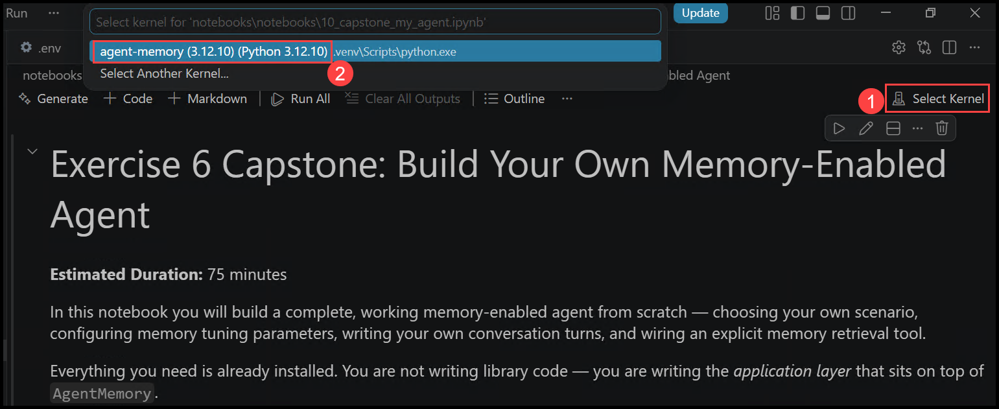

1. Read the first markdown cell, **"Exercise 6 Capstone: Build Your Own Memory-Enabled Agent"**. Read the scenario table carefully and making your choice.

   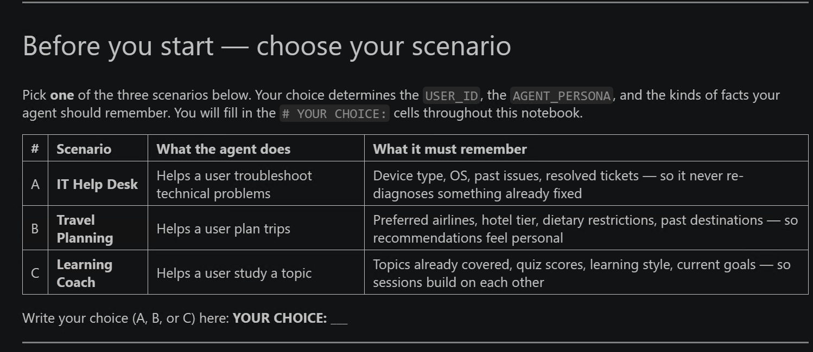

1. Run **Cell 1 — Setup: Imports, Environment, and Project Root**. This cell finds the project root, loads your `.env` file, validates the four required environment variables, and imports `AgentMemory` and `AgentMemoryConfig`.

   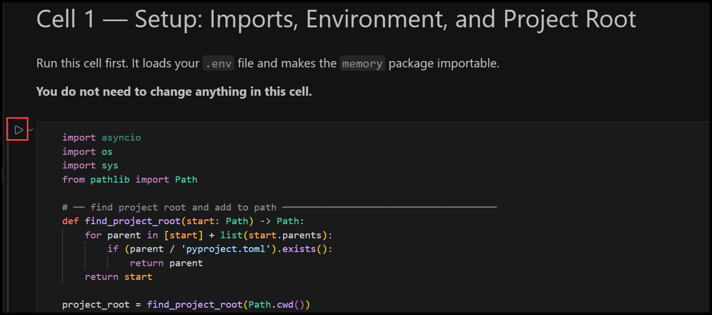

1. You will get the expected output as show in below image

   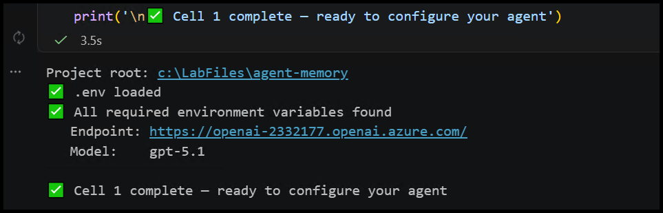

1. Run **Cell 2 — Configure Your Agent**. Read the reference block for your chosen scenario, then paste it into the `# YOUR CHOICE:` section of the cell, replacing the three `'___'` placeholders **(1)** and click on **Run (2)**.

   For **Scenario A** (IT Help Desk), paste below script:
   <details>
   <summary>Click here to expand</summary>

   ```python
   MY_SCENARIO   = 'A'
   USER_ID       = 'helpdesk-user-001'
   AGENT_PERSONA = (
       'You are an IT Help Desk assistant. '
       'You help users troubleshoot technical problems. '
       'Always check memory for the user\'s device type, OS, and past issues '
       'before suggesting solutions. Never ask for information the user already provided. '
       '{memory_context}'
   )
   ```
   </details>

   For **Scenario B** (Travel Planning), paste below script:

   <details>
   <summary>Click here to expand</summary>

   ```python
   MY_SCENARIO   = 'B'
   USER_ID       = 'traveler-001'
   AGENT_PERSONA = (
       'You are a Travel Planning assistant. '
       'You help users plan trips and recommend destinations, hotels, and airlines. '
       'Always use memory to recall preferred airline, hotel tier, dietary restrictions, '
       'and past trips before making suggestions. Make every recommendation feel personal. '
       '{memory_context}'
   )
   ```
   </details>

   For **Scenario C** (Learning Coach), paste below script:
   <details>
   <summary>Click here to expand</summary>

   ```python
   MY_SCENARIO   = 'C'
   USER_ID       = 'learner-001'
   AGENT_PERSONA = (
      'You are a Learning Coach assistant. '
      'You help users study topics and track their progress. '
      'Always check memory for topics already covered, quiz scores, and learning style '
      'before planning the next session. Build on prior sessions, never repeat basics. '
      '{memory_context}'
   )
   ```
   </details>

   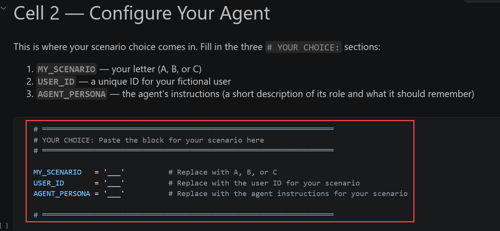

   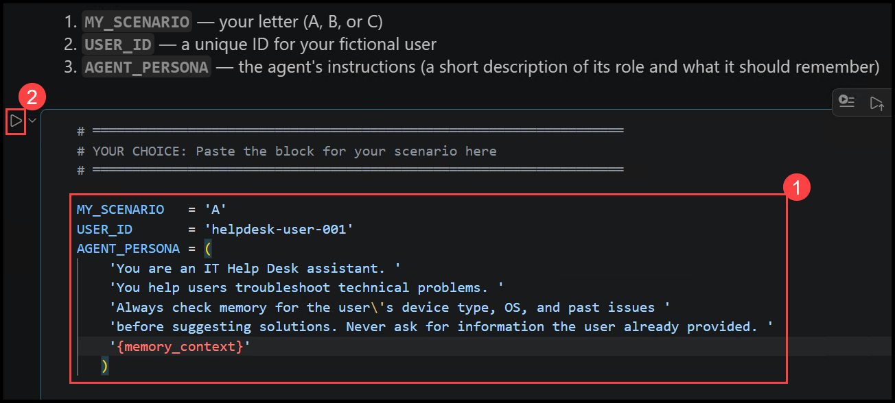

   >**Note:** in this lab guide we are using scenario A which is IT Help Desk and following images are also updated as per that scenario.

1. You will get the expected output as show in below image

   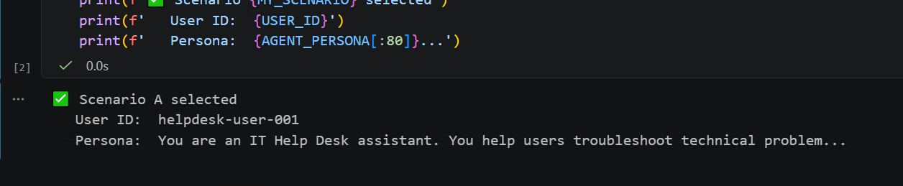

1. Run **Cell 3 — Tune Memory Configuration**. Read the parameter table in the markdown cell above it carefully — understand what each setting does before running.

   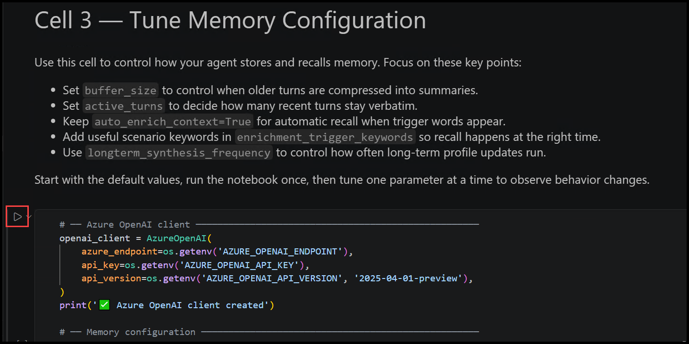

   The default values work for this lab session. You do not need to change them now. After you get a working result in Task 4, you are encouraged to come back and change `buffer_size` from `4` to `2` and re-run to observe earlier compression.

   **Expected output:**
   ```
   ✅ Azure OpenAI client created
   ✅ Memory config created
      DB path:              ...\capstone_a_helpdesk-user-001.db
      Buffer size:          4 turns before compression
      Active turns kept:    2
      Auto-enrich:          True
      Synthesis frequency:  every 1 session(s)
   ```

   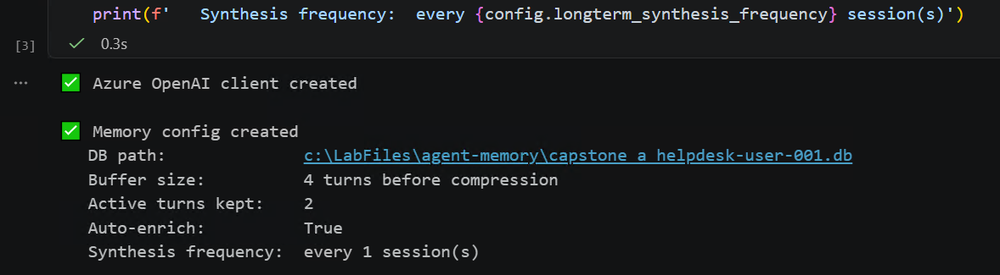

1. Run **Cell 4 — Build the Simple Agent**. This cell creates the `MyAgent` class — a lightweight wrapper around the Azure OpenAI chat API that accepts memory context through the `{memory_context}` placeholder in your persona.

   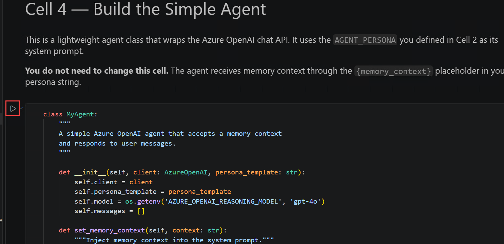

   **Expected output:**
   ```
   ✅ MyAgent created
      Model: gpt-5.1
   ```

   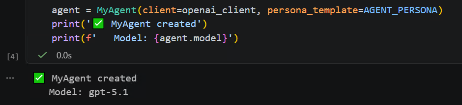

## Task 2: Run Session 1 and Establish Facts

In this task, you will fill in your Session 1 conversation turns and run them through your agent. The goal is to establish **3–4 specific, memorable facts** that your agent should be able to recall in Session 2 without the user repeating them.

### Why this design decision matters

The facts you establish in Session 1 are what your agent will be tested on in Session 2. Choose facts that are:

- **Specific** — "Dell XPS 15 running Windows 11" is better than "a Windows laptop"
- **Testable** — you need to be able to ask a question in Session 2 that can only be answered correctly if the agent remembered Session 1
- **Realistic** for your scenario — preferences, constraints, and background facts that a real user would share once and expect to not repeat

   > **Think of it this way:** if you were a real user of this agent, what would you be most annoyed to have to repeat in every new session?

1. Read the markdown cell above **Cell 5** in the notebook. It shows the example `SESSION_1_TURNS` conversation for all three scenarios.

   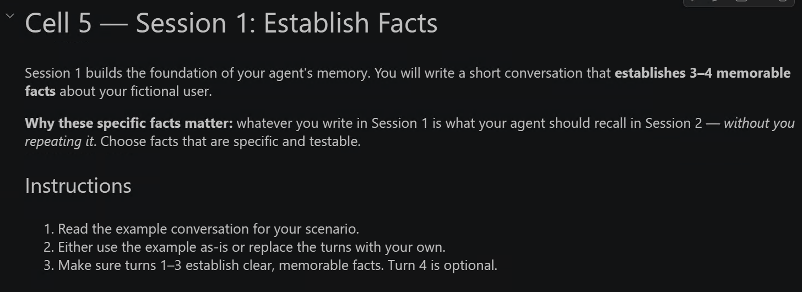

1. In **Cell 5**, find the `# YOUR CHOICE:` section. Paste the `SESSION_1_TURNS` list for your scenario from the markdown reference — or replace it with your own turns if you want to customise the scenario **(1)** and **(2)**.

   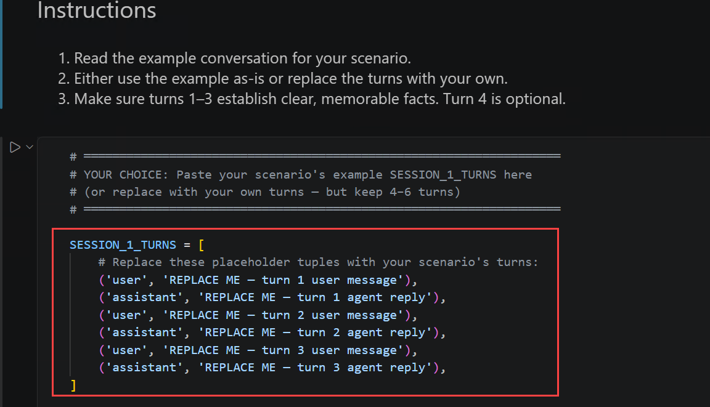

   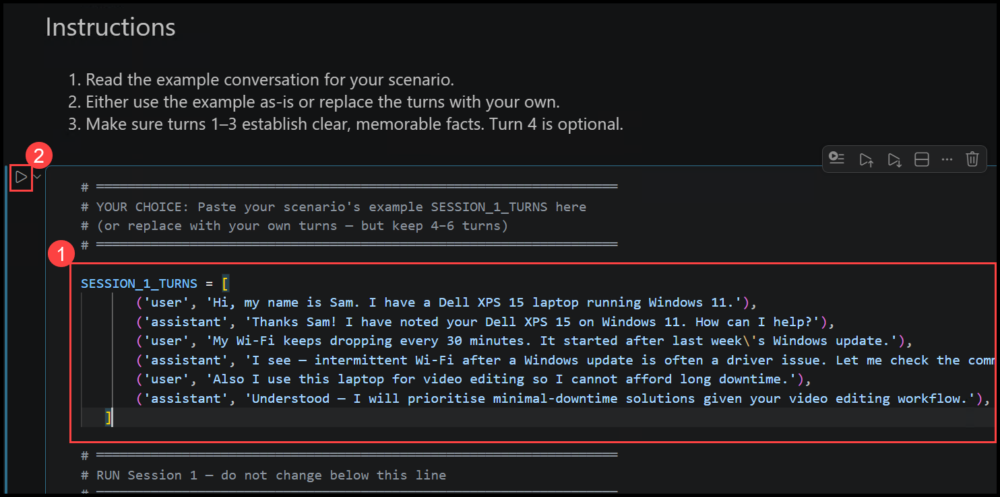

   **If using Scenario A (IT Help Desk)**, paste below script:
   <details>
   <summary>Click here to expand</summary>

   ```python
   SESSION_1_TURNS = [
       ('user', 'Hi, my name is Sam. I have a Dell XPS 15 laptop running Windows 11.'),
       ('assistant', 'Thanks Sam! I have noted your Dell XPS 15 on Windows 11. How can I help?'),
       ('user', 'My Wi-Fi keeps dropping every 30 minutes. It started after last week\'s Windows update.'),
       ('assistant', 'I see — intermittent Wi-Fi after a Windows update is often a driver issue. Let me check the common fixes for Dell XPS 15 on Windows 11.'),
       ('user', 'Also I use this laptop for video editing so I cannot afford long downtime.'),
       ('assistant', 'Understood — I will prioritise minimal-downtime solutions given your video editing workflow.'),
   ]
   ```
   </details>

   **If using Scenario B (Travel Planning)**, paste below script:
   <details>
   <summary>Click here to expand</summary>

   ```python
   SESSION_1_TURNS = [
       ('user', 'Hi! I\'m Maya. I always fly business class and prefer window seats.'),
       ('assistant', 'Welcome Maya! Noted — business class, window seat preference.'),
       ('user', 'I\'m vegetarian and I have a severe nut allergy, so food options matter a lot.'),
       ('assistant', 'Important — vegetarian with severe nut allergy. I will flag this for every itinerary.'),
       ('user', 'I visited Tokyo last year and would love somewhere equally cultural this time.'),
       ('assistant', 'Cultural destinations, similar to Tokyo. I will keep that in mind for your next trip recommendation.'),
   ]
   ```
   </details>

   **If using Scenario C (Learning Coach)**, paste below script:
   <details>
   <summary>Click here to expand</summary>

   ```python
   SESSION_1_TURNS = [
       ('user', 'Hi coach! I\'m Jordan and I\'m learning Python. I\'m a complete beginner.'),
       ('assistant', 'Great to meet you Jordan! Starting Python from scratch — noted.'),
       ('user', 'I just finished the basics: variables, loops, and functions. I scored 85 on the quiz.'),
       ('assistant', 'Excellent — 85 on the fundamentals quiz. You have a solid foundation.'),
       ('user', 'I learn best with real examples and short sessions, not long theory.'),
       ('assistant', 'Practical examples, short sessions — I will structure all future coaching accordingly.'),
   ]
   ```
   </details>

   

   

1. Watch the output section by section:

   - **"Memory context at start: X chars"** — in Session 1, this will be very small (0–50 chars). There is no prior history yet.
   - **Each `[USER]` / `[AGENT]` turn** — confirm the agent is responding coherently. It should not be asking for information already given in the same turn.
   - **"Insights extracted: N"** — after session end this should be `≥ 1`. If it is `0`, your turns may not have contained enough distinct facts.

   **Expected output (Scenario A example):**

   ✅ Session 1 complete


   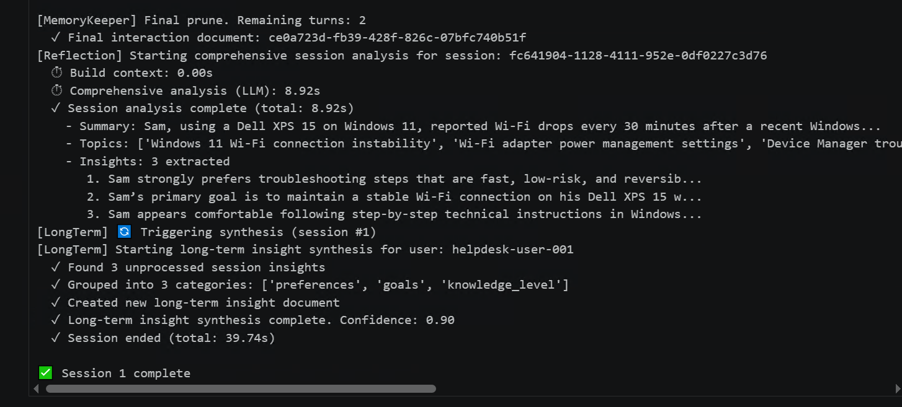

1. Check: are the facts you established (device, issue, constraint) visible in the **Insights extracted** list? If yes, Session 1 worked. If `Insights extracted: 0`, check that your turns are substantive — turns like `('user', 'OK')` or `('assistant', 'Sure')` will not produce insights.

## Task 3: Build and Test the Explicit Memory Retrieval Tool

In this task, you will fill in the test query for your scenario's explicit retrieval tool and confirm it returns results from Session 1 before using it in Session 2.

### What an explicit retrieval tool is and why you are building it

In Exercise 2, Task 3, you watched the Medical Assistant agent call `search_memory` explicitly before recommending an antibiotic — because the allergy was safety-critical and the agent needed to *choose* to look it up. The function `recall_user_history()` in Cell 6 is exactly that pattern, built for your scenario.

This is different from the `auto_enrich_context=True` setting already in Cell 3:

| | `auto_enrich_context=True` (Cell 3) | `recall_user_history()` tool (Cell 6) |
|---|---|---|
| **When it runs** | Automatically, every time a trigger keyword appears | Explicitly, when you call it in the conversation loop |
| **What it searches** | Pre-defined keyword-matched queries | The exact query you pass |
| **Visibility** | Invisible in the output | Visible — prints `🔍 [Explicit memory tool called]` |
| **Best for** | Convenience | Safety-critical or audit-required lookups |

1. In Cell 6, find the `# YOUR CHOICE:` section — specifically the `TEST_QUERY` line:
   ```python
   TEST_QUERY = 'REPLACE ME — enter a search query relevant to your scenario'
   ```

   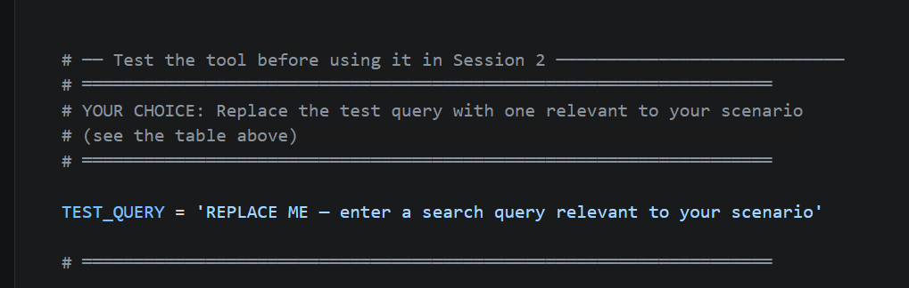

1. Replace it with the test query for your scenario and run the cell:

   **Scenario A — IT Help Desk:** paste below script:
   <details>
   <summary>Click here to expand</summary>

   ```python
   TEST_QUERY = 'What device and OS does this user have? Any known issues or constraints?'
   ```
   </details>

   **Scenario B — Travel Planning:** paste below script:
   <details>
   <summary>Click here to expand</summary>

   ```python
   TEST_QUERY = 'What are this user\'s travel preferences, dietary restrictions, and past trips?'
   ```
   </details>

   **Scenario C — Learning Coach:** paste below script:
   <details>
   <summary>Click here to expand</summary>

   ```python
   TEST_QUERY = 'What topics has this user covered, what was their score, and what is their learning style?'
   ```
   </details>

   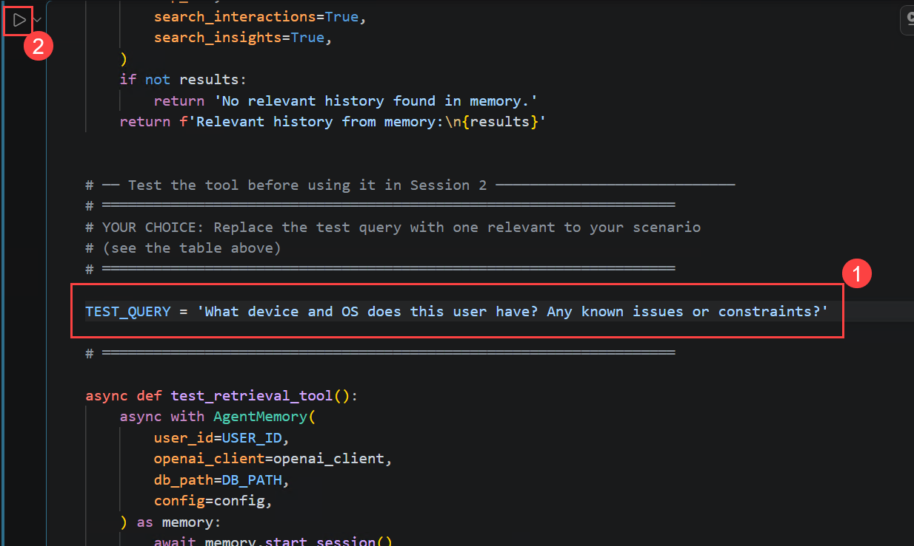

1. The cell first defines the `recall_user_history()` function, then runs it immediately as a standalone test against the data stored in Session 1.

   **Expected output (Scenario A example):**
   ```
   Testing retrieval tool with query:
     "What device and OS does this user have? Any known issues or constraints?"
   ────────────────────────────────────────────────────────────
   Relevant history from memory:
   1. User has a Dell XPS 15 running Windows 11...
   2. Intermittent Wi-Fi drops after Windows update...
   3. Requires minimal-downtime solutions for video editing...

   ✅ Retrieval tool test complete
      If the result above contains facts from Session 1, your tool is working.
   ```

   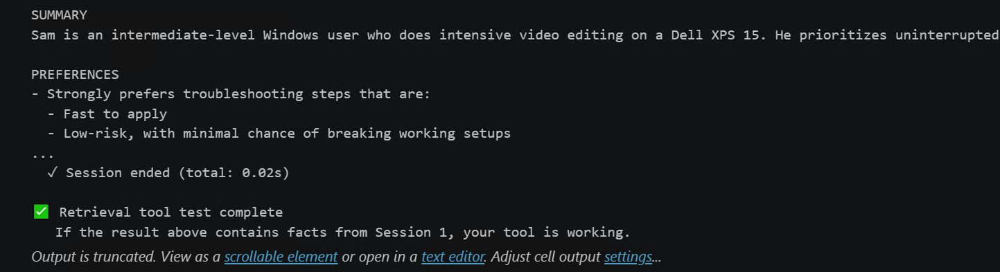

1. Confirm the result contains facts from Session 1 — the device type, the issue, or the constraint you established. If the result shows `No relevant history found in memory`, check:
   - That Cell 5 completed with `Insights extracted: ≥ 1`
   - That your `TEST_QUERY` is semantically related to what was said in Session 1
   - That the `.db` file exists in the project root (`capstone_a_helpdesk-user-001.db` for Scenario A)

   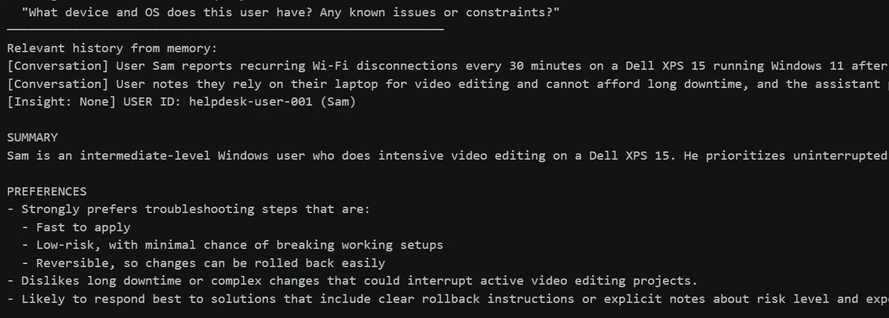

## Task 4: Run Session 2 and Verify Cross-Session Recall

This is the capstone moment. Session 2 starts as a completely fresh `AgentMemory` instance — a new Python object, fresh active buffer, nothing in it from Session 1. Yet when it starts, it loads Session 1's insights and session summary from the database. Your Session 2 turns will include a question the agent can only answer correctly if it remembered Session 1.

### The verification test

For each scenario, there is a clear pass/fail criterion:

| Scenario | Session 2 question | Pass: agent says... | Fail: agent says... |
|---|---|---|---|
| **A — IT Help Desk** | "Did we ever fix the Wi-Fi issue?" | References the Wi-Fi problem and the Dell XPS without being told again | "Could you remind me of the issue you were having?" |
| **B — Travel Planning** | "Can you suggest restaurants in Rome?" | Flags the nut allergy and vegetarian requirement without being told again | Gives generic restaurant suggestions with no allergy awareness |
| **C — Learning Coach** | "What should we cover today?" | Picks up from where Session 1 left off (after functions/loops, score 85) | "Let us start with the basics — what do you know so far?" |

1. In **Cell 7**, find the `# YOUR CHOICE:` section. 

   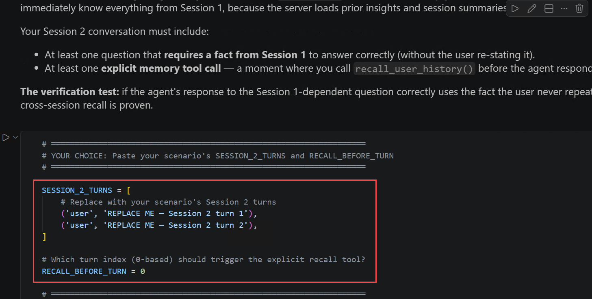

1. Paste the `SESSION_2_TURNS` and `RECALL_BEFORE_TURN` for your scenario and Run **Cell 7**

   **Scenario A — IT Help Desk:** paste below script:
   <details>
   <summary>Click here to expand</summary>

   ```python
   SESSION_2_TURNS = [
       ('user', 'Hi again. Now my laptop is making a loud fan noise all the time.'),
       ('user', 'Did we ever fix the Wi-Fi issue we talked about before?'),
   ]
   RECALL_BEFORE_TURN = 1
   ```
   </details>

   **Scenario B — Travel Planning:** paste below script:
   <details>
   <summary>Click here to expand</summary>

   ```python
   SESSION_2_TURNS = [
       ('user', 'I want to plan a trip to Rome. Can you suggest some restaurants?'),
       ('user', 'What hotels would you recommend? Keep my preferences in mind.'),
   ]
   RECALL_BEFORE_TURN = 0
   ```
   </details>

   **Scenario C — Learning Coach:** paste below script:
   <details>
   <summary>Click here to expand</summary>

   ```python
   SESSION_2_TURNS = [
       ('user', 'What should we cover today?'),
       ('user', 'Can you give me a short quiz on what I already know?'),
   ]
   RECALL_BEFORE_TURN = 0
   ```
   </details>

      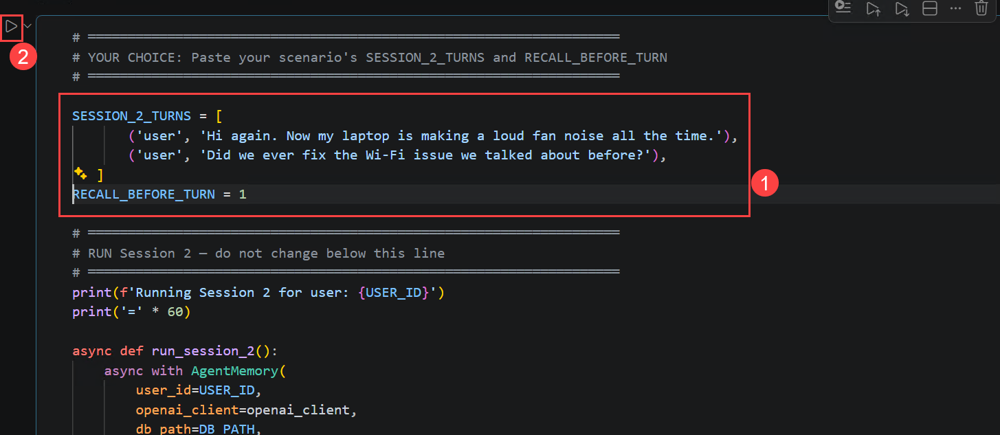

1. Watch the output in three specific places:

   **Check 1 — Context loaded at start:**
   ```
   Context loaded at Session 2 start: 1,243 chars
   ✅ Prior memory loaded — cross-session recall is active
   Preview: [MEMORY CONTEXT]
   === Long-term Insights ===
   User has a Dell XPS 15 running Windows 11...
   ```
   The number should be significantly larger than Session 1's starting context (which was 0). This proves the server loaded Session 1's data before a single new turn was processed.

      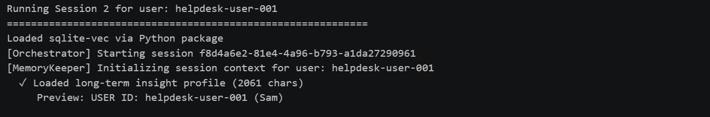

   **Check 2 — Explicit tool call:**
   ```
   🔍 [Explicit memory tool called]
   Retrieved: Relevant history from memory:
   1. User has Dell XPS 15, Windows 11...
   ```
   This line confirms the `recall_user_history()` tool ran and retrieved data for the specific turn.

      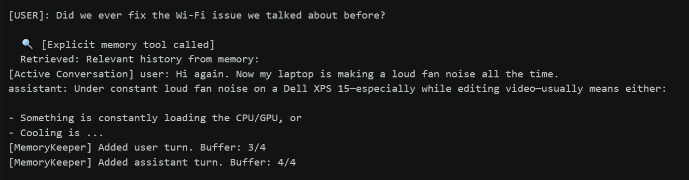

   **Check 3 — Agent response to the recall question:**
   Read the `[AGENT]` response after the turn where `RECALL_BEFORE_TURN` was triggered. For Scenario A, it should reference the Wi-Fi issue and the Dell XPS — information the user **did not repeat** in Session 2.

      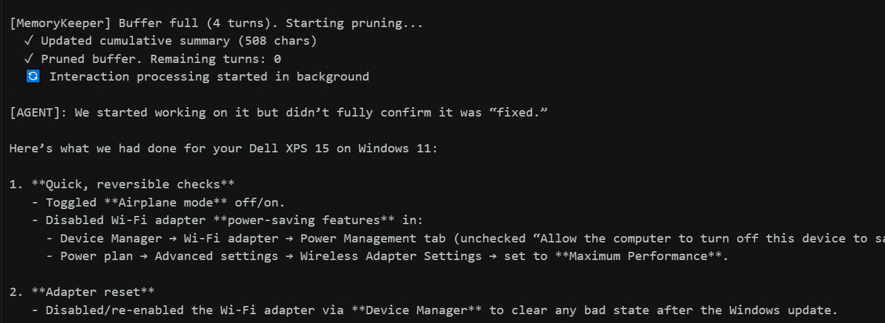

   **Full expected output structure (Scenario A):**
   ```
   Running Session 2 for user: helpdesk-user-001
   ============================================================
   Context loaded at Session 2 start: 1,243 chars
   ✅ Prior memory loaded — cross-session recall is active
   Preview: [MEMORY CONTEXT]
   === Long-term Insights ===
   User has a Dell XPS 15 running Windows 11...

   [USER]: Hi again. Now my laptop is making a loud fan noise all the time.
   [AGENT]: Hi Sam! Fan noise on your Dell XPS 15 can usually be caused by...

   [USER]: Did we ever fix the Wi-Fi issue we talked about before?

     🔍 [Explicit memory tool called]
     Retrieved: User experiences intermittent Wi-Fi drops after a Windows update...

   [AGENT]: Yes — in our last session you mentioned your Wi-Fi was dropping every
   30 minutes after a Windows update on your Dell XPS 15. We identified this as
   likely a driver issue. Did you get a chance to try the driver rollback steps?

   ────────────────────────────────────────────────────────────
   Session 2 ending...
   Total sessions recorded: 2
   Total insights now:      5

   ✅ Session 2 complete
   ```

   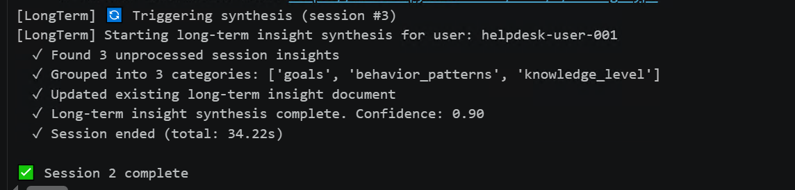

1. Run **Cell 8 — Verification Report**. This cell opens a third fresh `AgentMemory` instance (simulating a third session start), retrieves all sessions and insights, and prints a pass/fail report.

   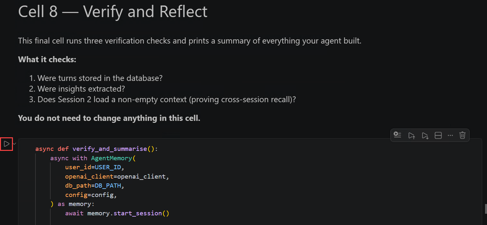

   **Expected output:**
   ```
   ╔══════════════════════════════════════════════════════════╗
   ║         EXERCISE 6 CAPSTONE — VERIFICATION REPORT       ║
   ╚══════════════════════════════════════════════════════════╝
     Scenario:    A
     User ID:     helpdesk-user-001

     ✅ Sessions recorded: 2
     ✅ Insights extracted: 5
     ✅ Cross-session context: 1,243 chars

     Insights summary:
       1. User has a Dell XPS 15 running Windows 11
       2. Intermittent Wi-Fi drops after Windows update — likely driver issue
       3. Requires minimal-downtime solutions for video editing
       4. New issue: fan noise in Session 2
       5. Wi-Fi issue was previously discussed

   ══════════════════════════════════════════════════════════
     🎉 ALL CHECKS PASSED — your memory-enabled agent works!
   ══════════════════════════════════════════════════════════
   ```

      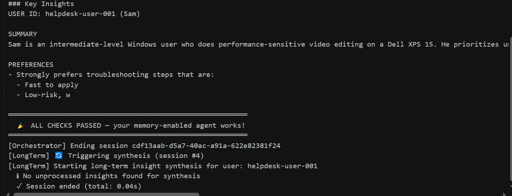

   > **If one or more checks fail:**
   >
   > | Check failed | Action |
   > |---|---|
   > | Sessions recorded: 1 | Re-run Cell 7 — Session 2 did not complete cleanly |
   > | Insights extracted: 0 | Re-run Cell 5 with more substantive turns (avoid one-word replies) |
   > | Cross-session context too small | Restart the kernel, re-run Cells 1–5 in order, then re-run Cell 8 |

## Stretch Goals (Optional)

These are optional challenges for learners who finish early. None of them are required for the verification report to pass.

**Stretch 1 — Change your scenario turns and re-run**
Go back to Cell 5 and write completely different Session 1 turns for your scenario. Delete the `.db` file first (run `import os; os.remove(DB_PATH)` in a new cell), then re-run Cells 5–8. Does the verification report still pass with your custom conversation?

**Stretch 2 — Tune buffer_size and observe compression earlier**
In Cell 3, change `buffer_size` from `4` to `2`. Delete the `.db` file and re-run Cells 5–7. In the Session 1 output, watch for the first time the system says `[Memory pruned - older turns summarized]` — it should now appear earlier in the turn sequence.

**Stretch 3 — Add a third session**
After running Cells 5–7, add a new code cell that runs a third session (copy the structure of Cell 7). Re-run Cell 8 and confirm `Sessions recorded: 3` and `Insights now: ≥ 6`. Check whether the insight profile evolved to reflect what was added in Sessions 2 and 3.

**Stretch 4 — Switch backend to Cosmos DB**
In Cell 3, change the `AgentMemory` constructor to use `db_type=DatabaseType.COSMOSDB` and add your Cosmos DB credentials. Delete the `.db` file and re-run Cells 5–8. Confirm the verification report still passes — proving your agent works identically across backends with one config change.
## Summary

In this exercise, you accomplished the following:

- **Chose a scenario** (IT Help Desk, Travel Planning, or Learning Coach) and configured a `USER_ID`, `AGENT_PERSONA`, and `AgentMemoryConfig` tuned for a short lab session — making four design decisions rather than following a fixed script.
- **Ran Session 1** and established 3–4 memorable facts through a scripted conversation, then confirmed they appeared in the `Insights extracted` list at session end.
- **Built an explicit memory retrieval tool** (`recall_user_history()`) using `memory.search()` and tested it directly against Session 1's stored data, confirming it returned the specific facts you established.
- **Ran Session 2** as a completely fresh `AgentMemory` instance, observed that the context loaded at session start was already non-empty (prior data loaded from the database), watched the `🔍 [Explicit memory tool called]` line fire at the designated turn, and confirmed the agent's response referenced Session 1 facts the user never re-stated in Session 2.
- **Ran the verification report** (Cell 8) and confirmed all three checks passed: sessions recorded ≥ 2, insights extracted ≥ 1, cross-session context > 50 chars.

You have successfully completed this exercise and the full lab. Click **Finish** to conclude.
