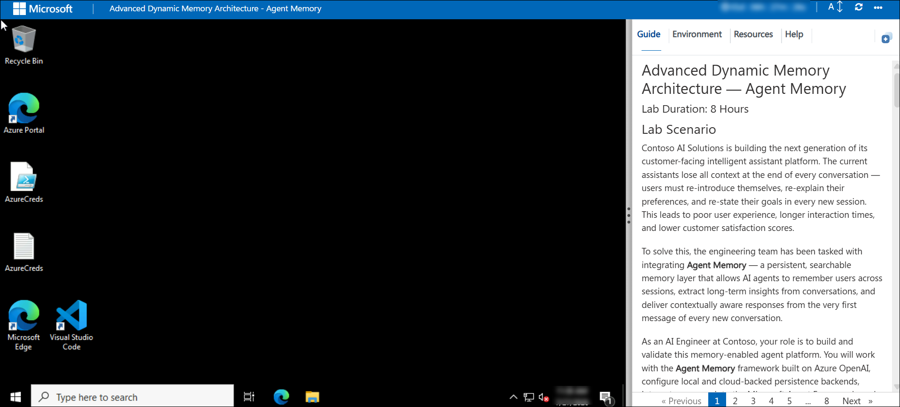
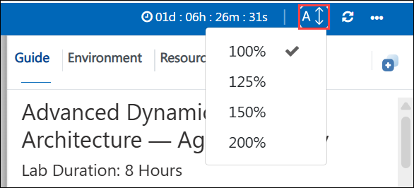
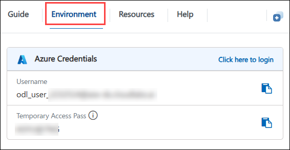
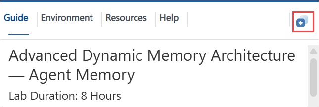
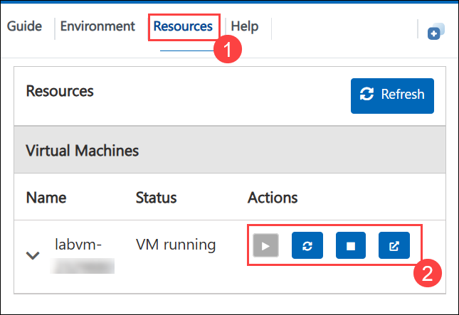
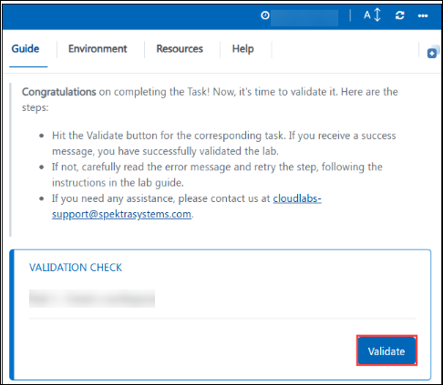
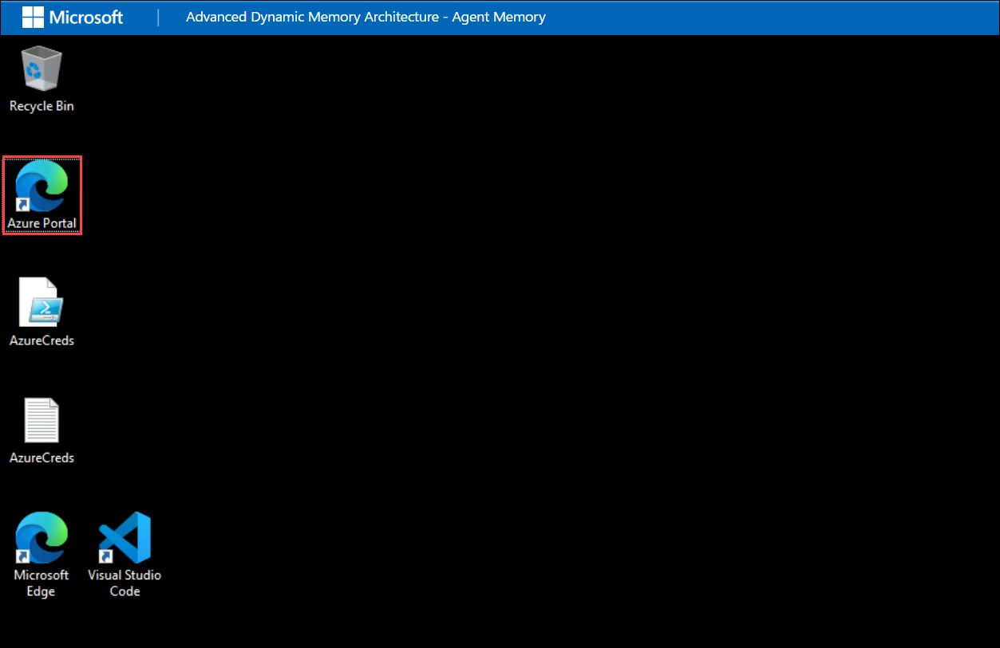
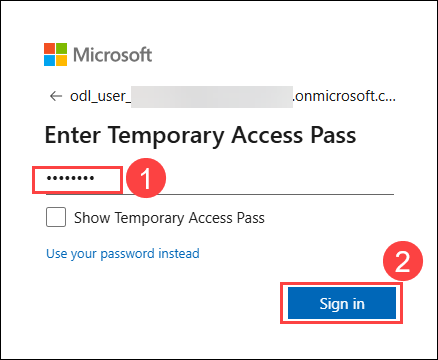
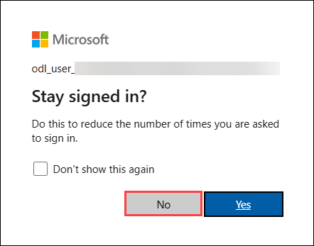
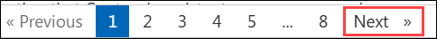

# Advanced Dynamic Memory Architecture — Agent Memory

### Lab Duration: 8 Hours

## 📘 Lab Scenario

Contoso AI Solutions is building the next generation of its customer-facing intelligent assistant platform. The current assistants lose all context at the end of every conversation — users must re-introduce themselves, re-explain their preferences, and re-state their goals in every new session. This leads to poor user experience, longer interaction times, and lower customer satisfaction scores.

To solve this, the engineering team has been tasked with integrating **Agent Memory** — a persistent, searchable memory layer that allows AI agents to remember users across sessions, extract long-term insights from conversations, and deliver contextually aware responses from the very first message of every new conversation.

As an AI Engineer at Contoso, your role is to build and validate this memory-enabled agent platform. You will work with the **Agent Memory** framework built on Azure OpenAI, configure local and cloud-backed persistence backends, integrate memory into the Microsoft Agent Framework, and ultimately build and deploy a production-ready memory-enabled agent for a real-world scenario — demonstrating that Contoso's assistants can now remember every user, forever.

## 📖 Lab overview
The **Advanced Dynamic Memory Architecture — Agent Memory** workshop is designed to teach developers how to build intelligent agents with persistent, searchable memory across multi-session conversations.

The lab begins with environment setup and local memory exploration using a zero-configuration SQLite backend, giving participants a concrete understanding of how `AgentMemory` stores turns, compresses older content into summaries, and recalls facts across sessions. Participants then integrate memory into the Microsoft Agent Framework as a context provider, observing how the system automatically injects prior knowledge into every agent response without any manual retrieval code.

As the lab progresses, participants move from local to cloud-scale persistence by connecting `AgentMemory` to **Azure Cosmos DB** — verifying that memory survives full application restarts and is accessible from anywhere. They explore advanced curation strategies including bounded itemized memory, which keeps the insight pool compact and relevant by scoring and pruning older facts, and compare it against free-form synthesis that resolves contradictions across sessions.

The final technical exercises cover the **FastAPI server mode** — exposing memory as a shared HTTP service that multiple clients can talk to simultaneously — and demonstrate the entire system through a real-time Streamlit visualization dashboard. The lab concludes with a guided capstone exercise where participants build their own memory-enabled agent from scratch for a scenario of their choice.

By completing this lab, participants will gain hands-on experience building, tuning, and deploying persistent memory for AI agents — moving from a stateless chatbot pattern to a production-grade memory system backed by Azure cloud services.

## 🎯 Lab Objective

## ⚙️ Prerequisites

Participants should have:

- An active **Microsoft Azure subscription** with access to Azure OpenAI and Azure Cosmos DB resources pre-provisioned by the organization.
- **Python 3.12** installed on the lab VM.
- **Visual Studio Code** with the Python and Jupyter extensions.
- **Basic Python knowledge** including async/await patterns, working with environment variables, and running scripts from the command line using `uv`.
- **Familiarity with Azure OpenAI** — knowing the difference between a deployment name and a model name, and how to find endpoint and key values in the Azure Portal.
- No prior Agent Memory experience required — the lab introduces all framework concepts from scratch.

## 🏗️ Architecture

## 🖼️ Architecture Diagram

### 🔍 Components explained
- **Azure lab VM**: your working environment for the entire lab.
- **Preloaded repository**: the source of all demos, configuration examples, tests, and infrastructure references used in the exercises.
- **`demo/`** and **`notebooks/`** : contains the runnable learning path scripts, including local memory, framework integration, server mode, and Cosmos DB examples.
- **`memory/` and `agent/`**: contain the core memory orchestration and agent-related implementation patterns.
- **`server/` and `client/`**: support service-based execution and interactive access patterns.
- **SQLite**: the local starting backend used to demonstrate persistent memory behavior without requiring cloud persistence first.
- **Azure Cosmos DB**: the cloud persistence backend introduced later in the lab.
- **Azure OpenAI configuration**: supports the model-driven memory processing used by the repo.
- **Streamlit and FastAPI**: provide live interaction patterns for service-mode exploration.

# 🚀 Getting Started with Lab

Welcome to the Modern Identity Governance & Secure Access with Microsoft Entra Workshop!. Let's begin by making the most of this experience:

## Accessing Your Lab Environment

Once you are ready to dive in, your virtual machine and guide will be right at your fingertips within your web browser.
 

## Lab Guide Zoom In/Zoom Out

To adjust the zoom level for the environment page, click the **A↕ : 100%** icon located next to the timer in the lab environment.

## Virtual Machine & Guide
 
Your virtual machine is your workhorse throughout the workshop. The guide is your roadmap to success.
 
## Exploring Your Lab Resources
 
To get a better understanding of your lab resources and credentials, navigate to the **Environment** tab.
 

 
## Utilizing the Split Window Feature
 
For convenience, you can open the guide in a separate window by selecting the **Split Window** button from the top right corner.
 

 
## Managing Your Virtual Machine
 
Feel free to **start, stop, or restart (2)** your virtual machine as needed from the **Resources (1)** tab. Your experience is in your hands!
 
	

## Lab Validation

After completing the task, hit the **Validate** button under the Validation tab integrated within your lab guide. If you receive a success message, you can proceed to the next task; if not, carefully read the error message and retry the step, following the instructions in the lab guide.

   
 
Now you're all set to explore the powerful world of technology. Feel free to reach out if you have any questions along the way. 

## Let's Get Started with Azure Portal
 
1. On your virtual machine, click on the Azure Portal icon as shown below:
 
    
 
2. You'll see the **Sign into Microsoft Azure** tab. Here, enter your credentials **(1)** and click **Next (2)**.
 
   - **Email/Username:** <inject key="azureUserName"></inject>
 
    
 
3. Next, provide your temporary password **(1)** and select **Sign in (2)**.
 
   - **Temporary Access Pass:** <inject key="AzureAdUserPassword"></inject>
 
      
 
4. If prompted to stay signed in, you can click **No**.

   
 
   
Now you're all set to explore the powerful world of technology. Feel free to reach out if you have any questions along the way. Enjoy your workshop!

## 📞  Support Contact

The CloudLabs support team is available 24/7, 365 days a year, via email and live chat to ensure seamless assistance at any time. We offer dedicated support channels tailored specifically for both learners and instructors, ensuring that all your needs are promptly and efficiently addressed.

Learner Support Contacts:

* Email Support: cloudlabs-support@spektrasystems.com 
* Live Chat Support: https://cloudlabs.ai/labs-support

Now, click on Next from the lower right corner to move on to the next page.

   

### Happy Learning!!

