# Exercise 1: Environment Setup & Local Memory

### Estimated Duration: 75 Minutes

## 📘 Scenario

Contoso Health Services is developing AI-powered applications that can retain conversation history and provide more contextual responses to users. To enable this capability, the development team is using the **Agent Memory** framework, which provides persistent memory, conversation summarization, and semantic retrieval for AI agents.

In this exercise, you will prepare the local development environment, configure the application to connect with the pre-provisioned Azure OpenAI resource, and execute the **Basic Agent Memory** notebook. The notebook uses **SQLite as a local memory store**, allowing you to observe how conversations are stored, summarized, and retrieved across multiple sessions without requiring any additional database infrastructure.

## 📖 Overview

Before building intelligent AI applications, it is important to understand how conversational memory works and why it is required. Instead of treating every interaction as an isolated request, Agent Memory enables applications to retain important information from previous conversations, making responses more relevant and context-aware.

In this exercise, you will verify the required development tools, configure the Azure OpenAI connection, install the project dependencies, and execute the **01_basic_memory.ipynb** notebook. Throughout the notebook, you will explore how Agent Memory stores conversations in a **SQLite local database**, automatically summarizes older interactions, retrieves previous context across sessions, and performs semantic search using vector embeddings.

## 🎯 Objectives

In this exercise, you will perform:

- Task 1: Verify Tools and Open the Project
- Task 2: Review Environment Configuration
- Task 3: Install Dependencies & Run Basic Demo
- Task 4: Observe Memory Behavior
- Task 5: Explore Memory Configuration Tuning (Optional)

## Task 1: Verify Tools and Open the Project

In this task, you will verify that the required development tools are available, open the Agent Memory project in Visual Studio Code, and become familiar with the repository structure before running the notebook.

1. On the **Desktop** of your **Lab VM**, launch **Visual Studio Code**.

   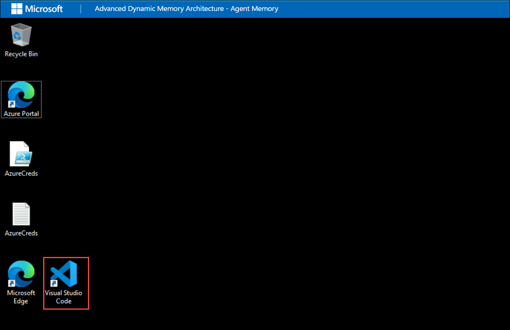

1. Once the IDE opens, if you see the ***Welcome to VS Code*** sign-in pop-up for GitHub, simply close the window by clicking the **X** in the upper-right corner.

   

1. Go to **File (1)** and click **Open Folder... (2)**.

   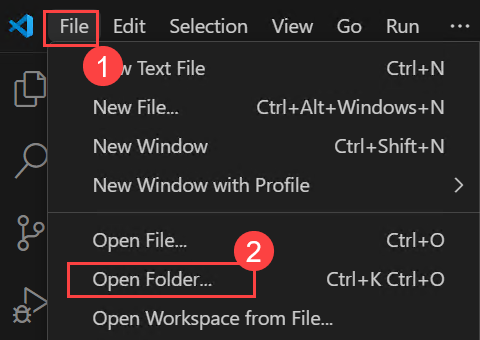

1. Navigate to `C:\LabFiles` **(1)**, select the **agent-memory (2)** folder and then click **Select Folder (3)**.

   

1. If there is a notification that it is in **Restricted mode**, click on **Manage**. 

   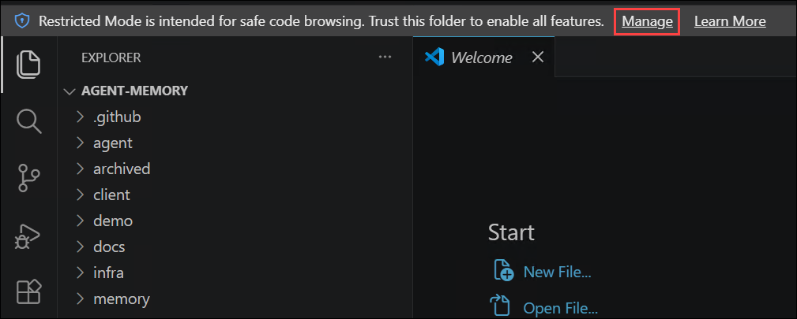

1. You will see a **Workspace Trust** wizard click on **Trust (1)** and close the wizard by clicking on **X (2)**.

   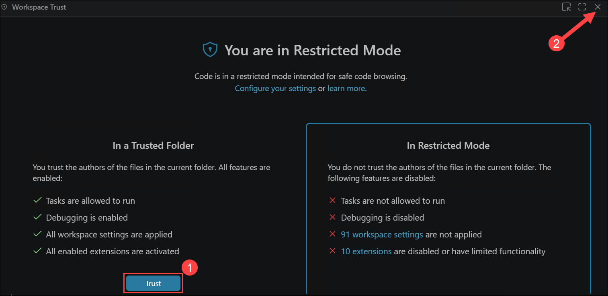

1. In the Explorer pane, confirm the following top-level folders are present: **notebooks/**, **demo/**, **memory/**, **server/**, **tests/**.

   

   Each folder serves a specific purpose within the project:

   - **notebooks/** contains sample notebooks and demonstrations used throughout the lab.
   - **demo/** contains sample python scripts and demonstrations used throughout the lab.
   - **memory/** contains the core Agent Memory implementation.
   - **server/** includes components used when exposing Agent Memory as a service.
   - **tests/** contains automated tests that validate the functionality of the project.

1. Open **demo/README.md** and take a moment to review the demo matrix table — it maps each numbered demo script/notebook to the feature it showcases.

   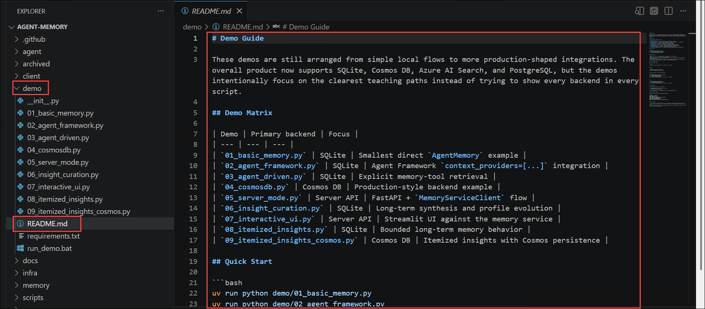

   > **Tip**: Reviewing the project documentation before running the notebooks is a good practice, as it provides context about the examples you will execute during the lab.

1. Click on the **ellipsis (...) (1)** in the top menu, then select **Terminal (2)** and click **New Terminal (3)**.

   

1. Verify the required tooling versions by running the following commands one by one:

   ```
   python --version
   uv --version
   git --version
   ```

   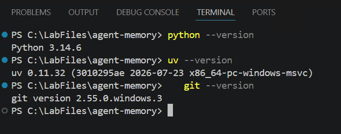

   > **Note:** Python **3.12 or later** is required for this lab because the SQLite vector extension (`sqlite-vec`) used by the local memory implementation depends on newer Python versions.

## Task 2: Review Environment Configuration

In this task, you will navigate to the pre-created Azure OpenAI resource, open it in the Azure portal, copy the endpoint and API key, and paste them into the project's `.env` file.

> **Note:** The Azure OpenAI resource and its model deployments have already been created in this lab environment — you do not need to create any new resources.

1. On the **Microsoft Edge** browser,go to **Azure portal**. In the search bar at the top, search for **Azure OpenAI (1)**, and select **Azure OpenAI (2)** from the **Services** section.

   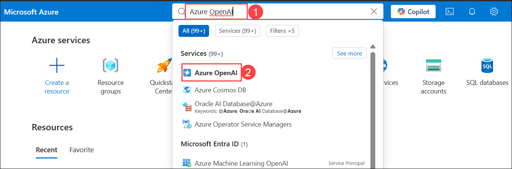

1. Select the **openai-<inject key="Deployment ID" enableCopy="false"></inject>**

   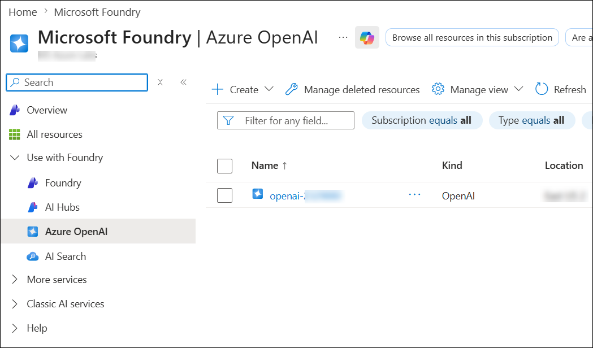

1. From the left navigation pane, expand **Resource Management** and then select **Keys and Endpoint (1)**. 

1. Copy the **Endpoint (2)** and paste it into Notepad for later use:

1. Copy the **KEY 1 (3)** and paste it into Notepad for later use.

   

1. Return to Visual Studio Code. In the Explorer pane, select and right click on `.env.example` **(1)** and select **Rename (2)**.

   

1. Rename the file to `.env` and click on it to open the file.

   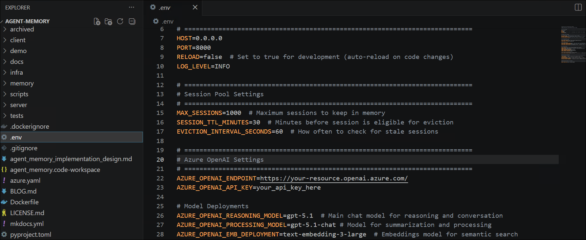

1. In the `.env` file, provide the following environment variables using the values you copied to Notepad:

   - **AZURE_OPENAI_ENDPOINT**: Repalce the endpoint value you copied in Step 4.
   - **AZURE_OPENAI_API_KEY**: Replace the API key you copied in Step 5.

   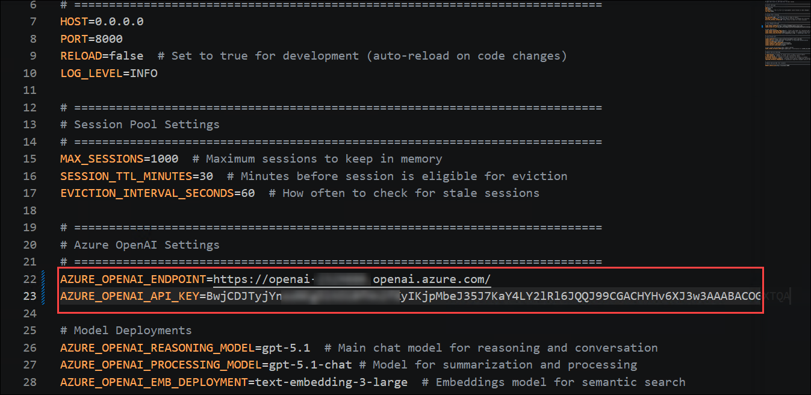

1. Save the changes made to the `.env` file by pressing **CTRL + S**.

## Task 3: Install Dependencies & Run Basic Demo

In this task, you will install the project dependencies, open the `01_basic_memory.ipynb` notebook, select the correct kernel, and execute the setup, initialization, and Session 1 cells while understanding exactly what each one does.

1. In the Visual Studio Code **terminal**, run the below command from the project root to install all dependencies:

   ```
   uv sync --extra dev
   ```

   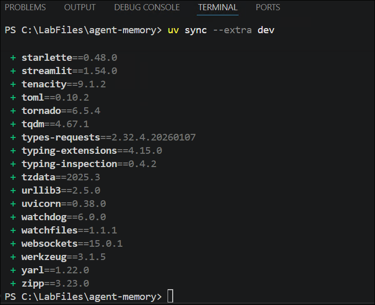

   > **Note:** This can take 5–10 minutes to complete. Wait for the command execution to complete, then proceed ahead.

1. In the Explorer pane, navigate to the  **notebooks (1)** folder and open the **01_basic_memory.ipynb (2)** file.

   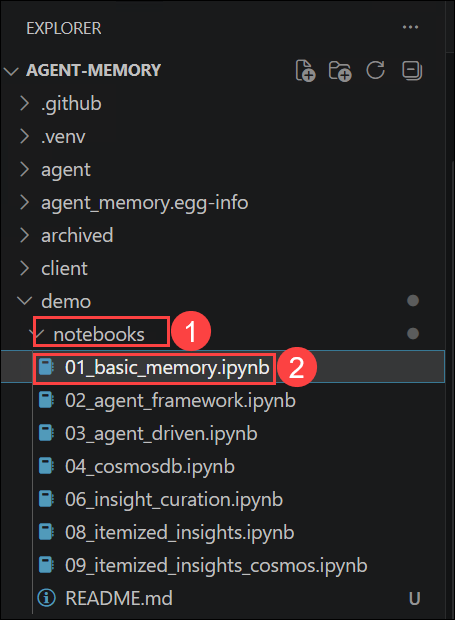

1. The notebook introduces the key capabilities that you will explore throughout this exercise, including:

   - Creating and storing conversations
   - Managing active conversation memory
   - Automatic summarization
   - Cross-session memory retrieval
   - Semantic search using embeddings

   Throughout this exercise, the notebook uses **SQLite** as the local memory store, allowing you to observe how Agent Memory behaves without requiring any additional database configuration.

      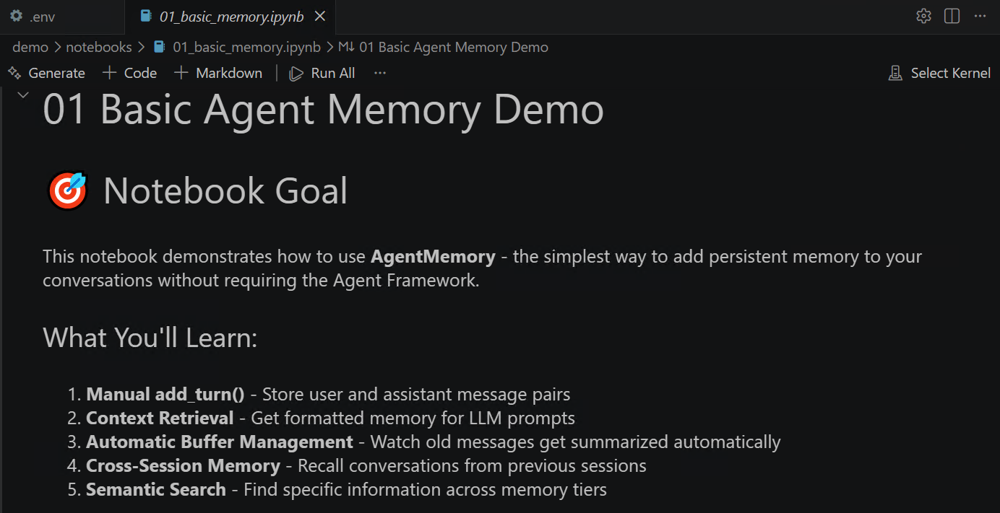

1. Click **Select Kernel (1)** in the top-right corner and choose **Install/Enable suggested extensions Python + Jupyter (2)** if prompted.

   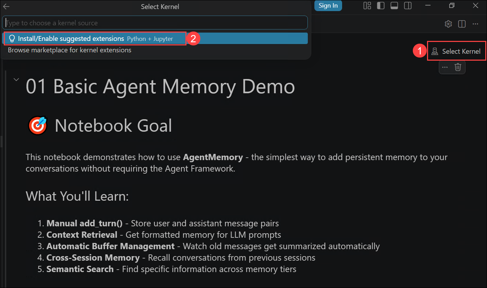

1. Wait for the Python extension to be installed.

   > **Note:** This can take 5–10 minutes to complete. Wait for the command execution to complete, then proceed ahead.

1. Once the Python extension is installed, click on **Select Kernel (1)** then select **Python Environments (2)** 

   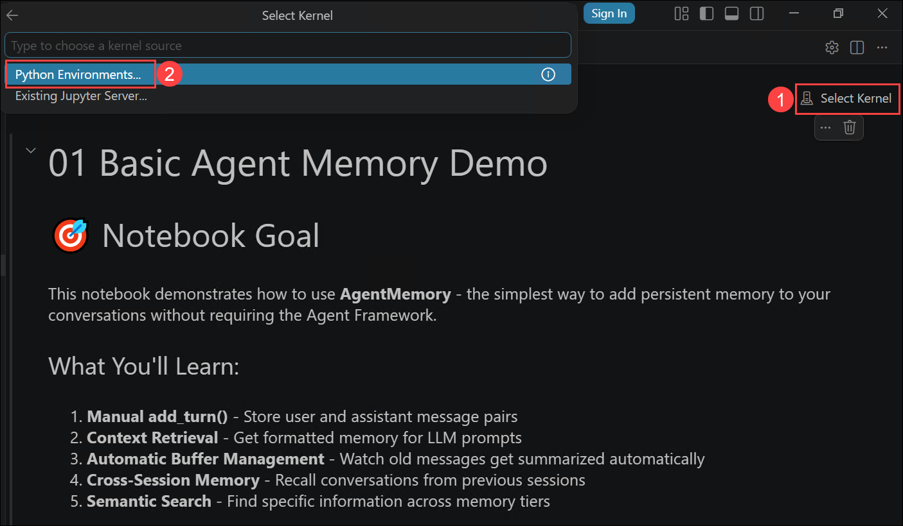

1. Select the project's virtual environment, **agent-memory(3.12.X)(Python 3.12.X)** from the list to ensure that the Jupyter Notebook runs in the correct Python interpreter with the necessary dependencies installed.

   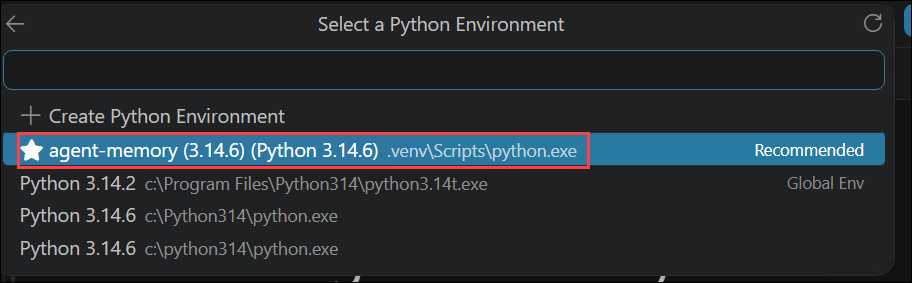

1. Run the first code cell under **Step 1: Setup and Configuration**.

   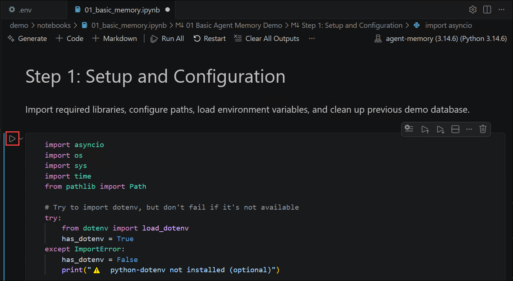

   This cell prepares the notebook environment before any Agent Memory operations begin.

   During execution, the notebook:

   - Imports the required Python libraries.
   - Locates the project root directory.
   - Loads the Azure OpenAI configuration from the **.env** file.
   - Defines the user identifier used throughout the demonstration.
   - Creates a fresh SQLite database for the demo by removing any previous database file.

   These initialization steps ensure that every notebook execution starts with a clean environment.

   After the cell completes successfully, verify that the following message appears:

   ✅ Step 1 Complete: `All imports and paths configured!`

      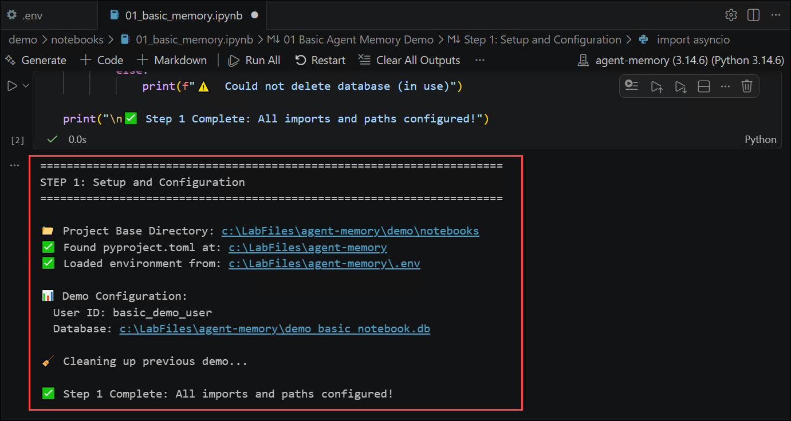

1. Run the next code cell under **Step 2: Initialize AgentMemory**. This cell creates the memory system itself:

   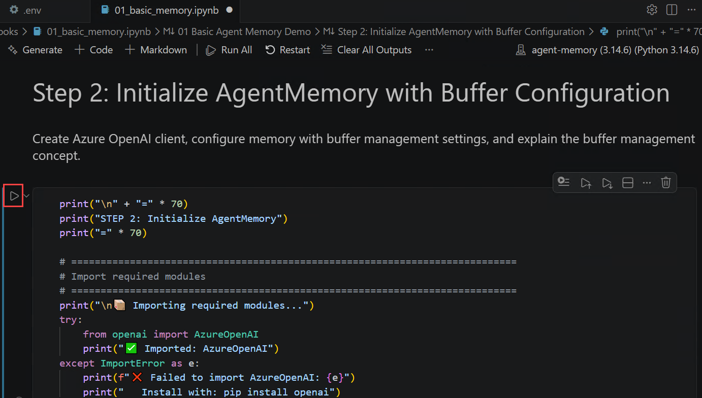

   During execution, the notebook:

   - Creates the Azure OpenAI client.
   - Validates the required environment variables.
   - Initializes the local SQLite memory database.
   - Creates the Agent Memory configuration.
   - Connects the memory engine with Azure OpenAI.

   #### Understanding Memory Configuration

   Agent Memory maintains a configurable conversation buffer to efficiently manage long conversations.

   The notebook initializes the following configuration:

   - **buffer_size** determines how many conversation turns are retained before summarization begins.
   - **active_turns** specifies how many of the most recent conversation turns remain available in their original form.
   - **longterm_synthesis_frequency** controls how frequently long-term insights are generated from completed conversations.

   As conversations become longer, older interactions are summarized automatically while recent messages remain available, allowing the AI application to preserve important context without exceeding the model's context window.

   After the initialization completes successfully, verify that the following message appears:

   You should see: `✅ AgentMemory initialized and ready!`
      
      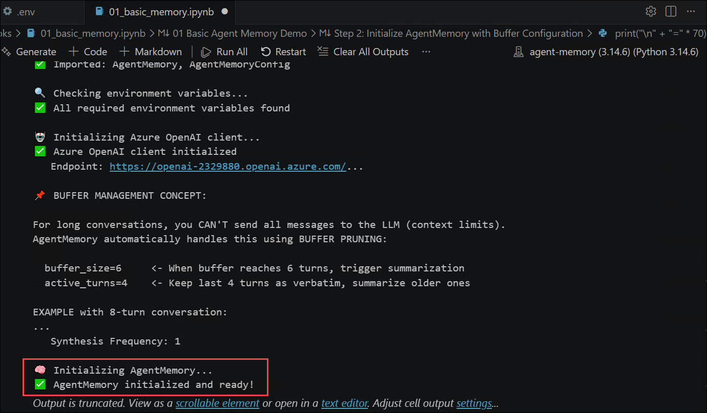

1. Run the next code cell under **Step 3: Session 1 — Multi-Turn Conversation with Buffer Pruning**. This is the main demonstration:

      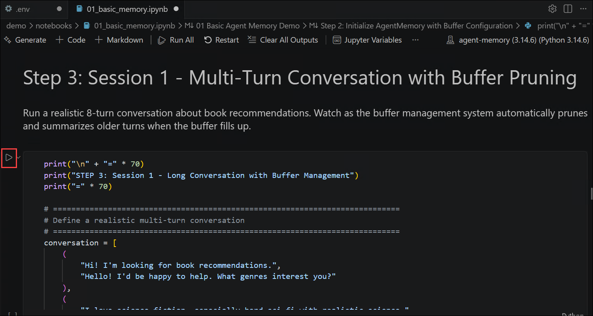

   This section demonstrates how Agent Memory stores a conversation while automatically managing its memory buffer.

   The notebook performs the following operations:

   - Starts a new conversation session.
   - Processes a predefined eight-turn conversation.
   - Stores every user and assistant interaction.
   - Monitors the configured memory buffer.
   - Automatically summarizes older conversation turns when the buffer limit is reached.
   - Generates the final conversation context for future retrieval.

   As additional messages are stored, Agent Memory continuously evaluates the configured buffer size. Once the buffer reaches its threshold, earlier interactions are condensed into a summary while the most recent conversations remain unchanged.

   This approach enables the application to retain important information while keeping the active context compact and efficient.


      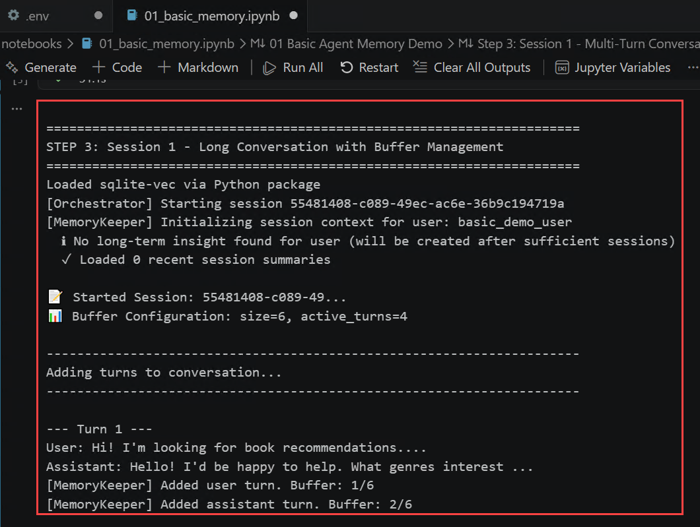

      >**Note**: To verify the complete output block, scroll down to the end of the output and click on **scrollable element**.

      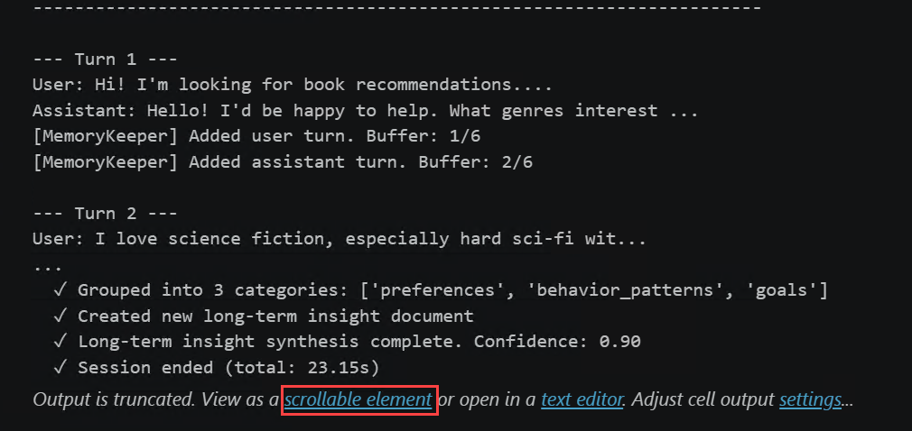

## Task 4: Observe Memory Behavior

In this task, you will explore how Agent Memory retrieves information across multiple sessions and performs semantic search on previously stored conversations. These capabilities enable AI applications to remember important information beyond a single conversation, providing more intelligent and context-aware responses.


1. Run the next code cell under **Step 4: Cross-Session Memory Recall**. This proves persistence across sessions:

      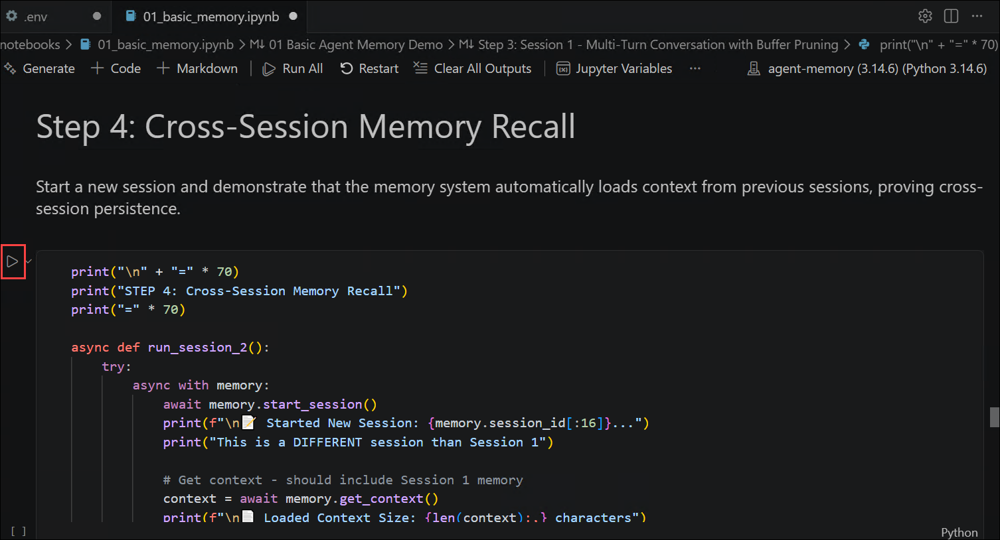

   This demonstration starts a **new conversation session** for the same user while retrieving relevant information stored during the previous session.

   During execution, the notebook performs the following actions:

   - Creates a new session for the existing user.
   - Retrieves the conversation context from previous sessions.
   - Loads previously generated conversation summaries.
   - Retrieves long-term insights extracted from earlier interactions.
   - Combines this information into a single context that can be used by the language model.

   Verify in the preview that details from the book conversation (Session 1) are present even though this session has stored nothing yet.

      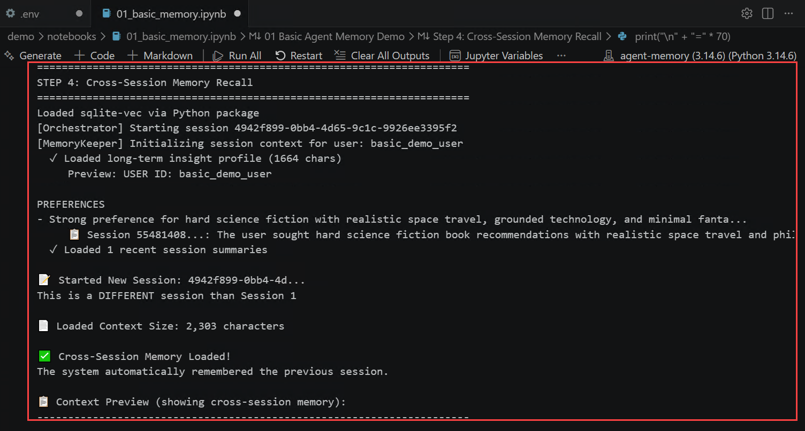

1. Run the final code cell under **Step 5: Semantic Search Demonstration**. This shows retrieval by meaning rather than keywords:

      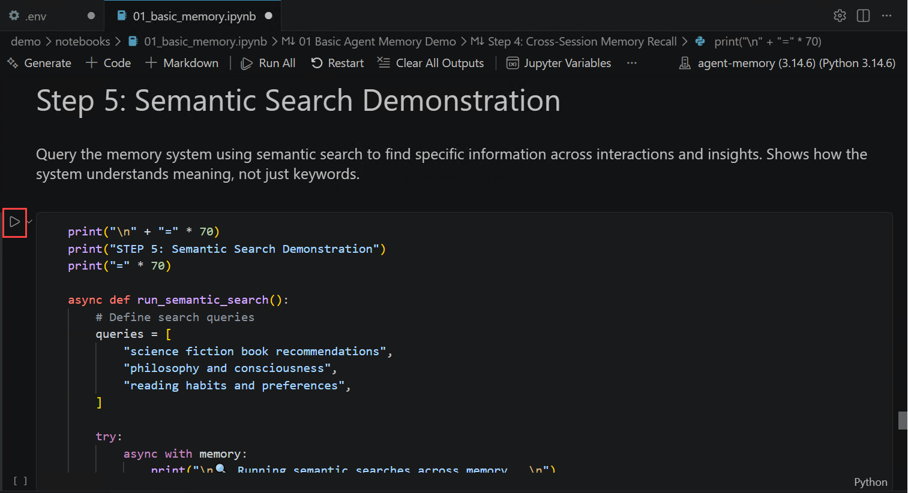

   This cell demonstrates how Agent Memory searches previously stored conversations using vector embeddings.

   During execution, the notebook:

   - Creates multiple semantic search queries.
   - Searches previously stored interactions.
   - Retrieves the most relevant conversations.
   - Displays the search results for each query.

   Rather than searching for exact keywords, semantic search compares the meaning of the query with previously stored conversations, making retrieval significantly more intelligent.

   You should see the output ending with: `🎉 NOTEBOOK COMPLETE!`

      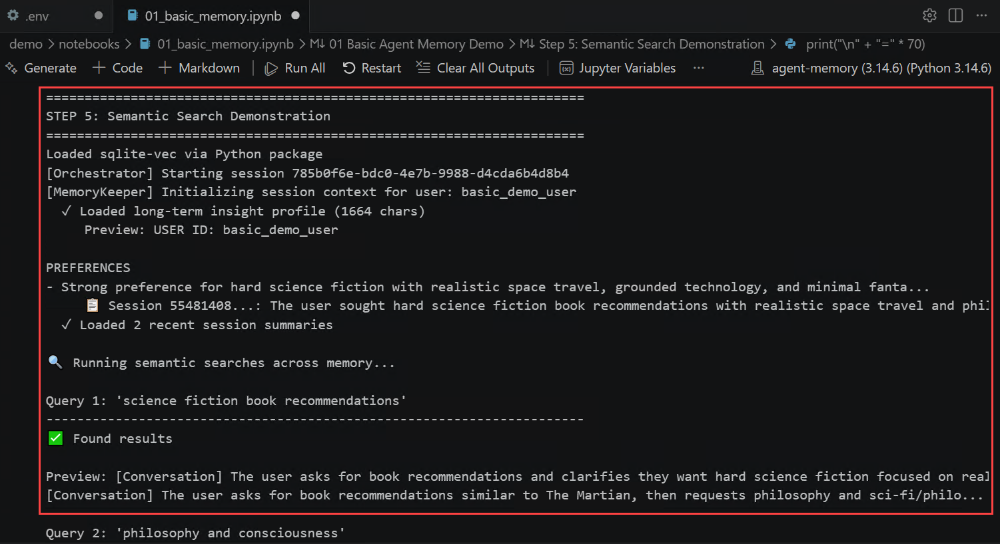

## Task 5: Explore Memory Configuration Tuning (Optional)

In this task, you will adjust the key memory configuration parameters in the notebook and re-run it to observe how behavior changes with different settings.

1. In the notebook, scroll to the **Step 2: Initialize AgentMemory** code cell and locate the **AgentMemoryConfig** block:

   ```
   config = AgentMemoryConfig(
       buffer_size=6,
       active_turns=4,
       longterm_synthesis_frequency=1,
   )
   ```
      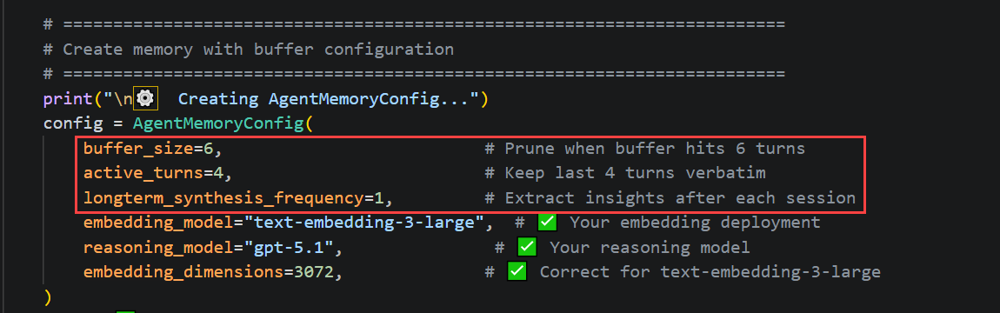


1. Change **buffer_size** to a lower value, such as `3`, and **active_turns** to `2`.

1. Restart the kernel by clicking **Restart** in the notebook toolbar and then **Run all** to execute all the cells from the top

   > **Note:** Restarting is required — the memory object and configuration are created at cell execution time, so edits do not take effect on an already-running kernel state.

      

1. Observe in the **Step 3** output how **summarization triggers earlier** than in the previous run — the buffer now fills after only 3 turns, so pruning happens much sooner in the 8-turn conversation, and only the last 2 turns remain verbatim.

1. Next, experiment with **longterm_synthesis_frequency** — this controls how often insights are extracted at session end. Re-run and note the effect on the insight generation messages in the output.

1. After observing the differences, revert all values to their defaults (`buffer_size=6`, `active_turns=4`, `longterm_synthesis_frequency=1`), restart the kernel, and re-run the notebook once more to leave the environment in a clean state.

   > **Note:** These same parameters appear again as production tuning knobs in a later exercise, so keep a note of what each one controls.

## 🧾 Summary

In this exercise, you prepared the local development environment and explored the core capabilities of the Agent Memory framework using a **SQLite local memory store**.

You accomplished the following:

- Verified the required development tools and explored the project structure.
- Configured the project to connect with the pre-provisioned Azure OpenAI resource.
- Installed the required project dependencies.
- Executed the **01_basic_memory.ipynb** notebook in Visual Studio Code.
- Observed how Agent Memory stores conversations and automatically manages the active memory buffer.
- Explored cross-session memory retrieval and semantic search using vector embeddings.
- Experimented with memory configuration settings and observed how they influence conversation summarization and long-term insight generation.

You have successfully completed this exercise. Select **Next >>** to continue to the next exercise.

   
