# Exercise 3: Azure Cosmos DB Backend

### Estimated Duration: 75 Minutes

## 📘 Scenario

In the first two exercises, you stored agent memory in a **SQLite** database — a file that lives directly on your local machine. That works perfectly for learning and prototyping, but it has a fundamental limitation: the moment you close the session or restart the machine, the data is tied to that single device. No other application, user, or cloud service can reach it.

In this exercise, you will move the **same agent memory system** to **Azure Cosmos DB** — a fully managed, cloud-hosted database that stores data as JSON documents and keeps that data available 24/7 from anywhere. You will run the same financial advisor scenario you used in Exercise 2, but this time everything the agent learns is stored in the cloud. You will then run a second notebook that shows how to keep the agent's long-term memory *bounded* — capping the number of insights so the agent stays sharp rather than accumulating noise forever.

The key insight of this exercise is simple: **you only change one thing** — the backend configuration. All the memory logic, the agent, and the conversation code stay exactly the same.

## 📖 Overview

In this exercise, you will:

- Understand why a cloud backend is needed and how it differs from SQLite
- Review and verify the Cosmos DB connection settings in your `.env` file
- Run the `04_cosmosdb.ipynb` notebook to see cloud-backed memory in action
- Verify that data was actually saved to Cosmos DB using the Azure Portal
- Run the `09_itemized_insights_cosmos.ipynb` notebook to see bounded long-term memory with a scoring and forgetting system
- Review the four supported backends and understand when to choose each one

## 🎯 Objectives

In this exercise, you will perform:

- Task 1: Understand Backend Options
- Task 2: Run the Cosmos DB Demo
- Task 3: Verify Data Persisted in Cosmos DB
- Task 4: Run Itemized Insights with Cosmos DB
- Task 5: Backend Selection Trade-offs (Read- Only)

---

## Task 1: Understand Backend Options

In this task, you will learn what a **backend** means in Agent Memory, understand why Cosmos DB is needed for production workloads, confirm the Cosmos DB credentials in your `.env` file, and navigate to the pre-created Cosmos DB account in the Azure Portal.

### What is a backend?

A **backend** is where Agent Memory physically stores its data — turns, summaries, session records, and insights. Think of it as the filing cabinet. The rest of the code (the agent, the memory API, the context injection) does not change when you swap the backend. You simply tell `AgentMemory` which type of database to use, and it handles the rest.

The project supports four backend options:

| Backend | Where data lives | Best for |
|---|---|---|
| `sqlite` | A `.db` file on your local machine | Learning, demos, local prototyping |
| `cosmosdb` | Azure cloud — a managed JSON document database | Production agents, multi-session apps, cloud deployments |
| `azure_ai_search` | Azure cloud — a search-optimized index | When semantic/vector retrieval quality is the top priority |
| `postgresql` | A SQL database (local or cloud) | Teams that already use Postgres in their stack |

You used `sqlite` in Exercises 1 and 2. In this exercise you switch to `cosmosdb`.

### What makes Cosmos DB different from SQLite?

| | SQLite | Cosmos DB |
|---|---|---|
| Where it runs | On your machine, as a file | In the Azure cloud |
| Who can access it | Only your local process | Any app, user, or service with credentials |
| What happens when you restart | Data stays on your machine | Data stays in the cloud — always available |
| Cost | Free (a local file) | Azure consumption-based pricing |
| Best use | Prototyping | Production, multi-user, or deployed apps |

### Steps

1. Open a browser on the lab VM and navigate to the Azure Portal:

   ```
   https://portal.azure.com
   ```

1. Sign in using the lab credentials provided in the **Environment** tab if prompted.

1. In the search bar at the top of the Azure Portal, search for **Azure Cosmos DB (1)** and select **Azure Cosmos DB (2)** from the Services section.

   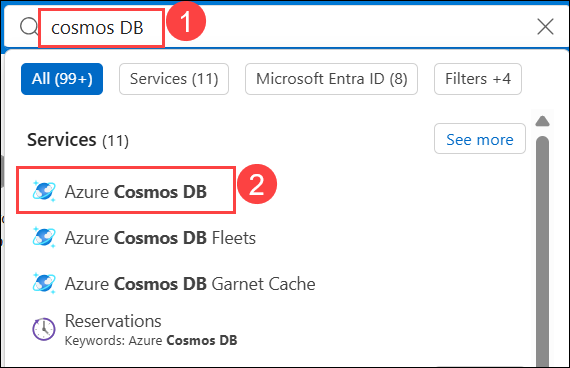

1. Select the **cosmos-<inject key="Deployment ID" enableCopy="false"></inject>**

   

1. From the left navigation pane, expand **Settings (1)** and then select **Keys (2)**. Copy the **URI (3)** and paste it in Notepad

1. Now copy the **Primary Key (4)** value and paste it in Notepad.

   

   > **Note:** Keys in the portal are hidden by default. Click the eye icon next to a key to reveal it.

1. Return to Visual Studio Code. In the Explorer pane, select `.env` **(1)** and provide the following environment variables using the values you copied to Notepad:

   - **COSMOS_ENDPOINT**: Repalce the endpoint value you copied in Step 5.
   - **COSMOS_KEY**: Replace the API key you copied in Step 6.

   

1. Save the changes made to the `.env` file by pressing **CTRL + S**.

## Task 2: Run the Cosmos DB Demo

In this task, you will open the `04_cosmosdb.ipynb` notebook, select the kernel, and execute each cell while understanding exactly what each one does. This notebook runs the same three-session financial advisor scenario from Exercise 2, but now all memory is stored in Azure Cosmos DB instead of a local SQLite file.

1. In the Explorer pane, navigate to the  **notebooks (1)** folder and open the **04_cosmosdb.ipynb (2)** notebook.

   

1. Take a moment to read the first markdown cell, **"Demo 4: Financial Advisor with CosmosDB Backend"**. It lists four things this notebook demonstrates:

   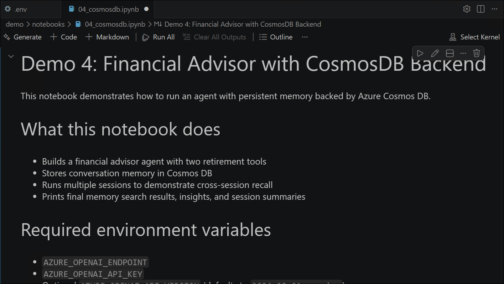

   - A financial advisor agent with two retirement tools
   - Conversation memory stored in **Cosmos DB**
   - Multiple sessions to demonstrate cross-session recall
   - Final memory search, insights, and session summaries

   It also lists the required environment variables — confirm these match what you verified in Task 3.1.

1. Click **Select Kernel (1)** in the top-right corner and choose **agent-memory(3.12.X)(Python 3.12.X) (2)** if prompted.

   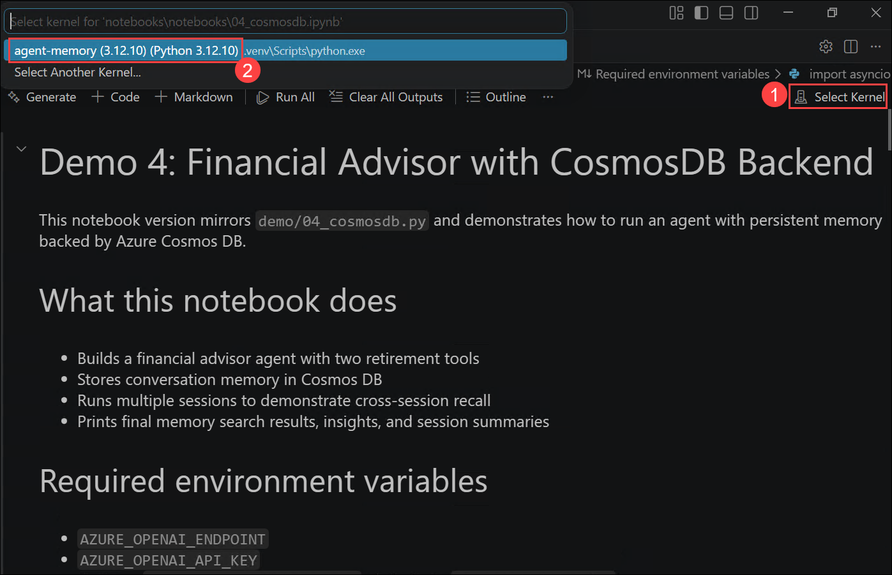

1. Run the first code cell (**Cell 1: Setup, Imports & Environment Configuration**). This cell:

   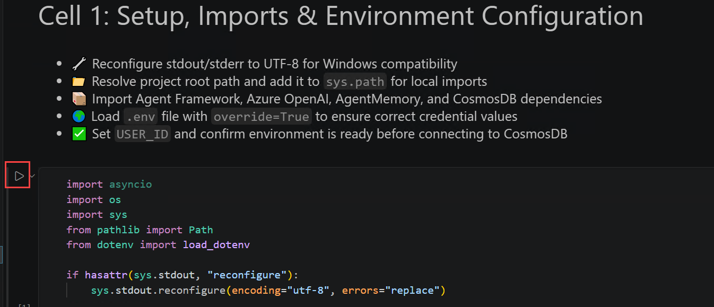

   - **Imports all required libraries**: `asyncio`, `os`, `sys`, `pathlib`, and `dotenv` for loading the `.env` file.
   - **Fixes text encoding** — ensures emoji and special characters print cleanly in the terminal (`sys.stdout.reconfigure`).
   - **Loads your `.env` file** — this is where the Cosmos DB and Azure OpenAI values from Task 3.1 are read.
   - **Finds the project root** and adds it to `sys.path` so the `memory` package can be imported.
   - **Imports the key classes**: `AzureOpenAI`, `Agent`, `AgentMemory`, `AgentMemoryConfig`, and critically — `DatabaseType` from `memory.db`.
   - **Sets `USER_ID = "sarah_demo_cosmos"`** — this is the unique key that identifies Sarah's memory in Cosmos DB. Every turn, summary, and insight stored by this demo will carry this ID.

   You should see: `Imports and environment setup complete.`

   

1. Run the second code cell (**Cell 2: Tools, Session Runner & CosmosDB Memory Setup**). This cell:

   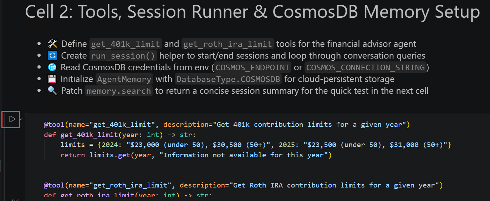

   - **Defines two financial tools** the agent can call:
     - `get_401k_limit(year)` — returns the 401k contribution limit for a given year (e.g., `"$23,500 (under 50), $31,000 (50+)"` for 2025).
     - `get_roth_ira_limit(year)` — returns the Roth IRA limit.
   - **Defines `run_session()`** — a helper function that starts a memory session, prints the loaded context (prior memory), runs a list of user queries through the agent, ends the session with reflection, and prints how many insights were extracted.

   The key line inside `run_session()` is:

   ```python
   context = await memory.get_context()
   print(f"Memory context loaded ({len(context)} chars):")
   ```

   On Session 1, this will print a small number of characters (no prior history). On Sessions 2 and 3, you will see a larger number — that is Sarah's profile being loaded from Cosmos DB automatically.

   You should see: `Tools, session runner, and Cosmos memory client are ready.`

   

1. Run the final code cell (**Cell 3: Run Three Sessions Demo with CosmosDB Memory**). This is the cell that actually connects to Cosmos DB and runs the full scenario. Watch the output section by section:

   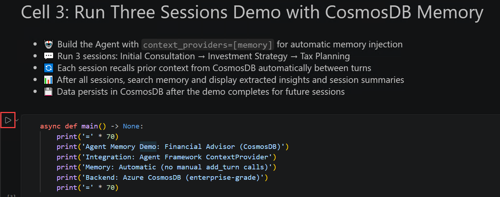

   **Connection check:**
   - The cell first checks for `COSMOS_ENDPOINT` or `COSMOS_CONNECTION_STRING`. If neither is found, it prints an error and stops — go back to your `.env` file if this happens.
   - If credentials are found, it prints: `CosmosDB: Endpoint configured` (or `Connection String configured`).

   **Configuration — the key difference from SQLite:**
   ```python
   memory = AgentMemory(
       user_id=USER_ID,
       openai_client=openai_client,
       db_type=DatabaseType.COSMOSDB,        # ← THIS IS THE ONLY CHANGE
       connection_string=cosmos_conn,
       config=config,
   )
   ```
   Everything else — the agent, the tools, the session flow — is identical to the SQLite demo. `db_type=DatabaseType.COSMOSDB` is the single line that switches the backend.

   **Session 1 — Initial Consultation:**
   - Sarah introduces herself: *"I'm Sarah, 35, software engineer making $150,000/year."*
   - Watch the `Memory context loaded (X chars)` line — this should be very short, because there is no prior history for this user yet.
   - At session end: `Insights: N` — the number of facts the system extracted about Sarah.

   **Session 2 — Investment Strategy:**
   - Sarah asks: *"Based on what we discussed before, what asset allocation do you recommend?"*
   - Watch the `Memory context loaded (X chars)` line again — this should now be **larger** than Session 1, because Sarah's profile from Session 1 was retrieved from Cosmos DB.
   - The agent's response should reference Sarah's risk tolerance and 30-year time horizon from Session 1.

   **Session 3 — Tax Planning:**
   - Sarah asks about tax optimization *"given my income and the retirement accounts we discussed."*
   - The context should be even richer, drawing on both Sessions 1 and 2.

   **Final inspection:**
   - `memory.search("What is Sarah's risk tolerance?")` — a semantic search that retrieves the stored answer.
   - `memory.get_sessions()` — all three sessions with their auto-generated summaries.
   - `memory.get_insights()` — the extracted facts about Sarah, each with a category and confidence score.

   You should see the output ending with a cleanup confirmation.

   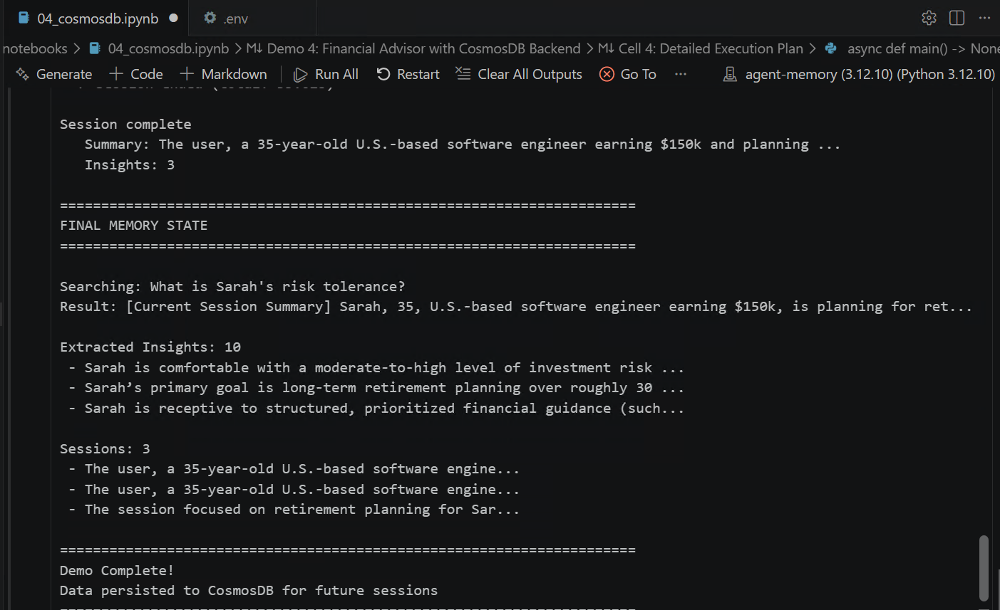

   > **Note:** If the cell fails with a `CosmosDB connection error` or `authentication error`, verify your `COSMOS_ENDPOINT` and `COSMOS_KEY` values in `.env`, save the file, restart the kernel, and re-run all cells from the top.

## Task 3: Verify Data Persisted in Cosmos DB

In this task, you will confirm that the data written in Task 3.2 actually exists in your Azure Cosmos DB account by browsing the containers in Data Explorer, inspecting a stored JSON item, and verifying that memory survives a full kernel restart.

1. Return to your browser and In the search bar at the top of the Azure Portal, search for **Azure Cosmos DB (1)** and select **Azure Cosmos DB (2)**.

   

1. Select the **cosmos-<inject key="Deployment ID" enableCopy="false"></inject>**

   

1. From the left navigation pane, select **Data Explorer**.

   

1. In the Data Explorer, expand the **agent_memory_db** database node. Inside **agent_memory_db**, expand each container to see what the demo created. You should find containers similar to the following:

   - **interactions** — the raw conversation turns (Sarah's questions and the advisor's answers).
   - **session_summaries** — the auto-generated summaries produced at the end of each session.
   - **insights** — the durable facts extracted about Sarah (risk tolerance, income, retirement timeline, etc.).

   

1. Click on the **interactions (1)** container to expand it, then click **Items (2)** underneath it.

1. Click on any item in the list to open its **JSON document (3)** in the right pane. Verify that:

   - The `user_id` field shows `"sarah_demo_cosmos"` — matching the `USER_ID` set in the notebook.
   - The document contains the actual conversation text from Task 2.

   

   > **Note:** In Azure Cosmos DB for NoSQL, every piece of data is stored as a JSON document inside a **container** (similar to a table in SQL, but schema-free). Each document has a unique `id` and a `partition key` — in this project, the partition key is the `user_id`, which means all of Sarah's data is grouped together for efficient retrieval.

1. Click on the **insights (1)** container → **Items (2)** and open one of the insight documents. Confirm it contains a fact extracted from the conversation — for example, Sarah's risk tolerance or income level.

   

1. Now verify **cross-run persistence** — this is the most important part. Return to Visual Studio Code, and **restart the notebook kernel** by clicking the **Restart** button in the notebook toolbar.

   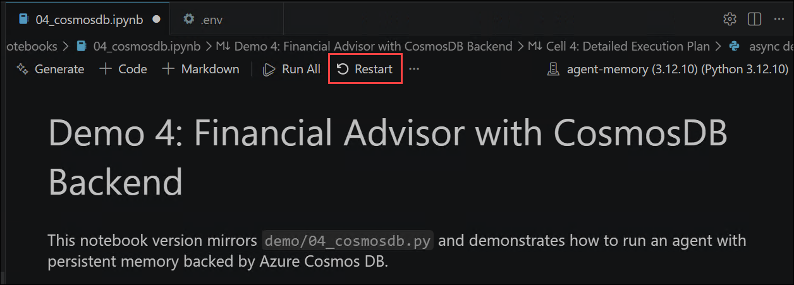

1. Run only the first two cells again (Cell 1 — imports and Environment, Cell 2 — tools and sessions) to reinitialize the environment. Do **not** run the **Cell 4: Detailed Execution Plan**.

1. Click on  **+code** above **Cell 4: Detailed Execution Plan** and run the following snippet to confirm prior data is accessible immediately after a fresh kernel start:

   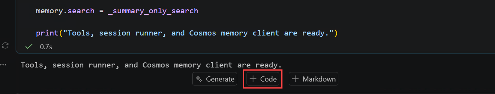

1. Add the following code snippet **(1)** then click the **Run Cell** button **(2)**.

   ```python
   result = await memory.search("What is Sarah's risk tolerance?")
   print(result)
   ```

   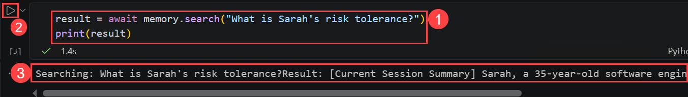

1. Review the output **(3)** and verify that it returns Sarah's **moderate-to-high risk tolerance** from **Session 1**. This confirms that Agent Memory successfully retrieves persisted data from **Azure Cosmos DB**, even after starting a new kernel with no in-memory conversation state.

   > **Note:** This is the key difference from SQLite: with SQLite, persistence is local to the machine. With Cosmos DB, a completely separate application running anywhere — a web API, a mobile app, another engineer's laptop — would get the same answer from the same data.

## Task 4: Run Itemized Insights with Cosmos DB

In this task, you will run the `09_itemized_insights_cosmos.ipynb` notebook. This notebook introduces a more advanced memory concept: **bounded long-term memory** — a system where the agent can only keep a fixed number of insights at any time, and older or less-used insights are automatically removed to make room for newer, more relevant ones.

### Why bounded memory?

Imagine an agent that has been talking to a user for two years. If every insight from every session accumulates forever, the agent's memory grows without limit — eventually injecting so much context into every prompt that it becomes slow, expensive, and noisy. Bounded memory solves this by applying three scoring rules to decide which insights to keep:

- **Recency** — a new insight gets a temporary priority boost so it is not immediately dropped.
- **Frequency** — an insight that is referenced again in later sessions gets stronger (its `access_count` rises).
- **Forgetting** — an insight that is never referenced again gradually decays and is eventually pruned.

This notebook simulates six months of client sessions, capped at `MAX_INSIGHTS = 5`, and shows how the insight table evolves over time.

1. In the Explorer pane, navigate to the  **notebooks (1)** folder and open the **09_itemized_insights_cosmos.ipynb (2)**.

   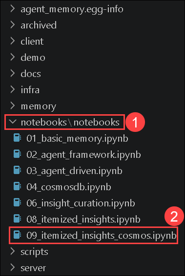

1. Click **Select Kernel (1)** in the top-right corner and choose **agent-memory(3.12.X)(Python 3.12.X) (2)** if prompted.

   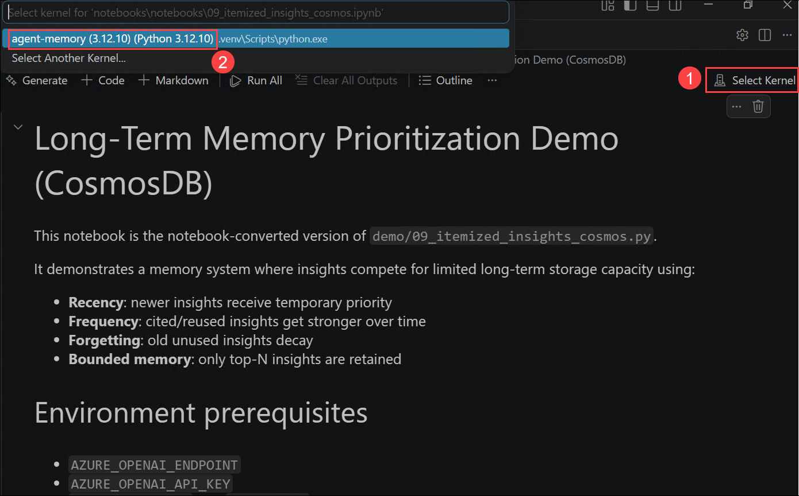

1. Run the first code cell (**Cell 1 — Environment Setup & Configuration**). This cell:

   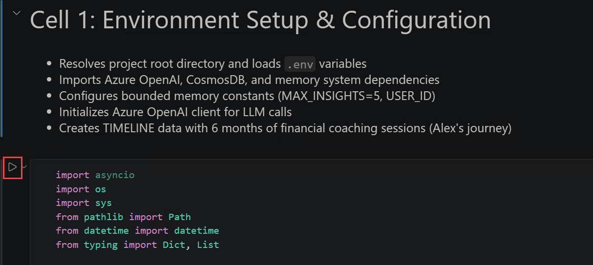

   - **Loads your `.env` file** and resolves the project root.
   - **Imports the low-level Cosmos DB classes** directly — `CosmosDBDatabase`, `Reflection`, `LongTermInsightItem`, `rank_insights`, `calculate_retention_score`. Unlike the previous notebook, this demo bypasses the `AgentMemory` wrapper and works directly with the database and reflection engine to give you full visibility into the scoring system.
   - **Sets `USER_ID = "memory_priority_demo_cosmos"`** and **`MAX_INSIGHTS = 5`**.
   - **Defines the TIMELINE** — six pre-scripted sessions for a user called Alex, simulated across January–June 2025:
     - Month 1: Alex is 28, earns $120k, very risk-averse due to 2008 family losses, interested in Roth IRA.
     - Month 2: Alex opens a Roth IRA, still conservative (money market fund).
     - Month 3: Tax season questions, plans to max out the Roth IRA.
     - Months 4–6: Alex's situation and preferences evolve — watch how the insight table changes.

   You should see: `[Setup complete]` or equivalent output.

   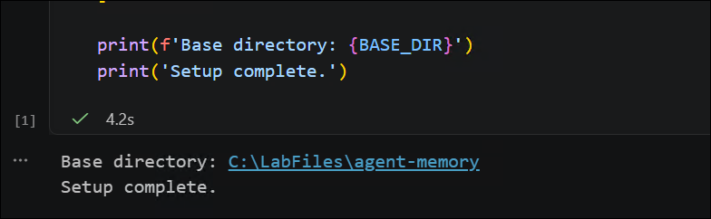

1. Run the second code cell (**Cell 2 — Helper Functions for Insight Management**). This cell defines the utility functions the main demo uses:

   

   - **`print_insight_table(items, now, title)`** — prints a formatted table of current insights showing their `ID`, `Score` (retention score), `Access` count (how many times they have been cited), `Age`, `Importance`, and the first 38 characters of the insight text. You will see this table printed before and after every session in the main run.
   - **`get_insight_items(db, user_id)`** — queries Cosmos DB for all stored long-term insight items for the user.
   - **`cleanup_demo_data(db, user_id)`** — deletes all existing insights for the demo user so each run starts clean.
   - **`prune_insights(db, user_id, items, max_items, now)`** — the core **bounded memory function**: ranks all insights by their retention score and deletes any beyond `MAX_INSIGHTS`. Pruned items are permanently removed from Cosmos DB.

   You should see output as: `Helper functions are ready`

      

1. Run the final code cell (**Cell 3 — Execute Full 6-Month Memory Simulation**). Watch the output section by section — it is long, but each section tells a clear story:

   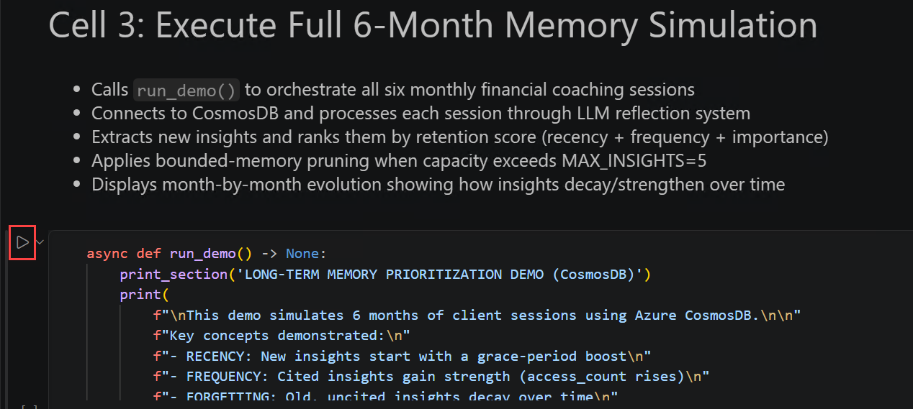

   **Connection:**
   - The cell connects to Cosmos DB using your credentials and calls `cleanup_demo_data()` to delete any prior insights for this demo user — ensuring a clean run.
   - You should see: `[Connecting to Azure CosmosDB...]` followed by `[Connected successfully]`.

   **For each of the six sessions, watch for this pattern:**

   *Before the session:*
   ```
   Memory State BEFORE Session:
   ID         Score  Access      Age  Importance   Text
   ...
   ```
   This table shows exactly which insights are in Cosmos DB **before** this session processes. In Session 1 (Month 1) it will say `[No existing insights - this is the first session]`.

   *During the session:*
   - `[Processing session...]` — the notebook sends the session's turns to the reflection engine to extract new insights.
   - `New insights: N` — how many new insights were extracted from this session.
   - Each new insight is printed with its generated ID and the first 50 characters of its text.
   - `Cited existing: [...]` — which prior insight IDs were referenced in this session (these get their `access_count` incremented, making them stronger).

   *After the session — the pruning decision:*
   Once the insight count exceeds `MAX_INSIGHTS = 5`, the notebook prints which insights were **kept** and which were **pruned** (removed from Cosmos DB). Look for lines like:
   ```
   BOUNDED MEMORY: 6 insights → kept 5, pruned 1
   Pruned (low retention score): [insight ID]
   ```

   **By Session 6**, compare the insight table to what it was after Session 1 — you will see that:
   - Insights about Alex's early risk-averse stance may have decayed and been pruned.
   - Insights that were repeatedly referenced (like the Roth IRA) have high `access_count` scores and remain.
   - The agent's memory is now a curated, scored representation of what matters most about Alex — not a raw dump of everything that was ever said.

   

1. After the main run completes, return to the **Azure Portal Data Explorer** and refresh the **insights** container. Confirm that exactly **5** (or fewer) insight documents exist for `user_id = "memory_priority_demo_cosmos"` — the pruning was real, not just simulated.

   

1. Compare the two notebooks by verifying the following differences in the output:

   - **`04_cosmosdb.ipynb`** — insights accumulate without a cap. The `get_insights()` call at the end shows every insight extracted across all sessions.
   - **`09_itemized_insights_cosmos.ipynb`** — the insight count never exceeds `MAX_INSIGHTS = 5`. Older, less-referenced insights are physically deleted from Cosmos DB.

## Task 5: Backend Selection Trade-offs (Read- Only)

In this task, you will verify the four supported backends in the project's codebase, review a complete comparison table, and confirm why Cosmos DB is the right intermediate step between a local prototype and a production deployment.

### Step 1 — Verify the four backend types in the code

1. In Visual Studio Code Explorer pane, navigate to **memory/db/** and open the file that defines the `DatabaseType` enum (look for a file named `__init__.py`, `factory.py`, or similar).

1. Confirm the four accepted values appear in the code:

   ```python
   class DatabaseType(str, Enum):
       SQLITE = "sqlite"
       COSMOSDB = "cosmosdb"
       AZURE_AI_SEARCH = "azure_ai_search"
       POSTGRESQL = "postgresql"
   ```

   > **Note:** The exact file name may vary between repo versions. Use **CTRL + SHIFT + F** in VS Code to search across all files for `DatabaseType` if you cannot find it immediately.

### Step 2 — Review the backend comparison

Review the following table. Verify each row against your direct experience from Exercises 1, 2, and 3:

| Backend | Where data lives | Best fit | Strength | Limitation |
|---|---|---|---|---|
| **SQLite** | A `.db` file on your local machine | Local dev, demos, single-machine prototyping | Zero configuration — works immediately with no credentials | Data is tied to one machine; no other app or user can access it |
| **Cosmos DB** | Azure cloud — managed JSON document store | Production agents, multi-session apps, cloud deployments | Durable cloud persistence, globally available, JSON-native, serverless option | Requires Azure credentials and incurs cloud cost |
| **Azure AI Search** | Azure cloud — search-optimized index | When semantic/vector retrieval quality is the priority | Best-in-class hybrid (keyword + vector) retrieval | Higher setup complexity; less suited as a general-purpose store |
| **PostgreSQL** | SQL database (local or cloud-hosted) | Teams already standardizing on relational storage | Familiar SQL tooling, strong operational ecosystem | Requires schema management; less natural for JSON/vector workloads |

### Step 3 — Verify Cosmos DB as the practical intermediate step

1. In the Explorer pane, open the **04_cosmosdb.ipynb** notebook and locate Cell 4 again. Find this line:

   ```python
   db_type=DatabaseType.COSMOSDB,
   ```

1. Confirm that **every other line** in the `AgentMemory(...)` constructor — `user_id`, `openai_client`, `config` — is identical to what you would write for `DatabaseType.SQLITE`. The only change is one argument.

1. This is what makes Cosmos DB the right intermediate step:

   - You write your agent code against the local SQLite backend — no cloud costs, instant feedback.
   - When you are ready to deploy, you change **one line** to `db_type=DatabaseType.COSMOSDB` and provide credentials.
   - Your agent code, memory logic, session management, and insight curation all continue working unchanged.

1. Confirm this by locating the SQLite initialization from Exercise 1's notebook (**01_basic_memory.ipynb**, Cell 2) alongside the Cosmos DB initialization in this exercise — place them side by side in split view (**right-click the tab → Split Right**) and verify that the only difference is the `db_type` argument and the Cosmos DB connection string.

## 🧾 Summary

In this exercise, you accomplished the following:

- Understood the difference between the four supported backends (SQLite, Cosmos DB, Azure AI Search, PostgreSQL) and when to choose each one
- Verified the Cosmos DB endpoint and key in your `.env` file and navigated to the pre-provisioned Cosmos DB account in the Azure Portal
- Ran the `04_cosmosdb.ipynb` notebook and observed the three-session financial advisor scenario with cloud-backed memory — watching the `Memory context loaded` size grow from Session 1 to Session 3 as Sarah's profile accumulated
- Confirmed persistence was real by browsing the `interactions`, `session_summaries`, and `insights` containers in Data Explorer, inspecting the raw JSON documents, and verifying that a fresh kernel restart could still recall Sarah's risk tolerance from Cosmos DB
- Ran the `09_itemized_insights_cosmos.ipynb` notebook and observed the bounded memory system — six simulated monthly sessions, a hard cap of `MAX_INSIGHTS = 5`, and the pruning function removing lower-scored insights from Cosmos DB in real time, with the scoring driven by recency, frequency of citation, and forgetting decay
- Confirmed in Data Explorer that exactly 5 (or fewer) insight documents remained after the bounded demo, proving that pruning is a real cloud database operation — not just a display filter
- Verified that switching from SQLite to Cosmos DB requires changing exactly one argument (`db_type=DatabaseType.COSMOSDB`) with all agent and memory logic unchanged

You have successfully completed this exercise. Click **Next >>** to continue to the next exercise.
